# Activity Diagram
## Sistem Absensi Magang

## 📊 Overview
Dokumen ini menjelaskan activity diagram untuk berbagai proses dalam sistem absensi magang.

## 🔄 Activity Diagrams

### 1. Activity Diagram: Proses Login

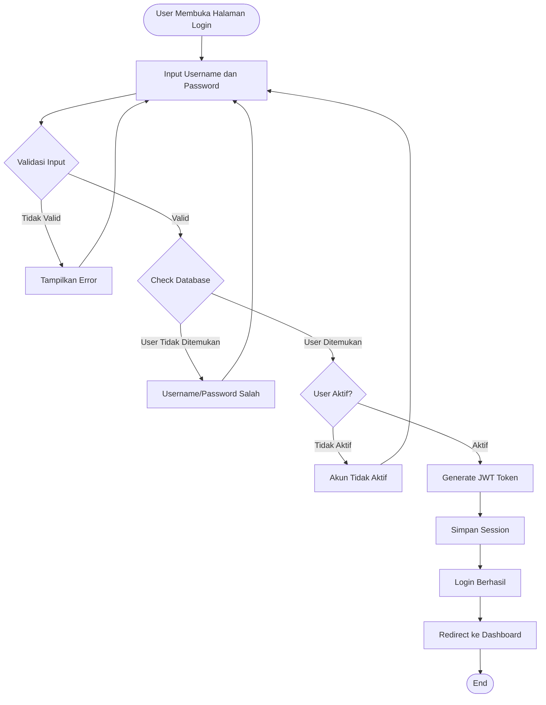

### 2. Activity Diagram: Proses Absensi Masuk

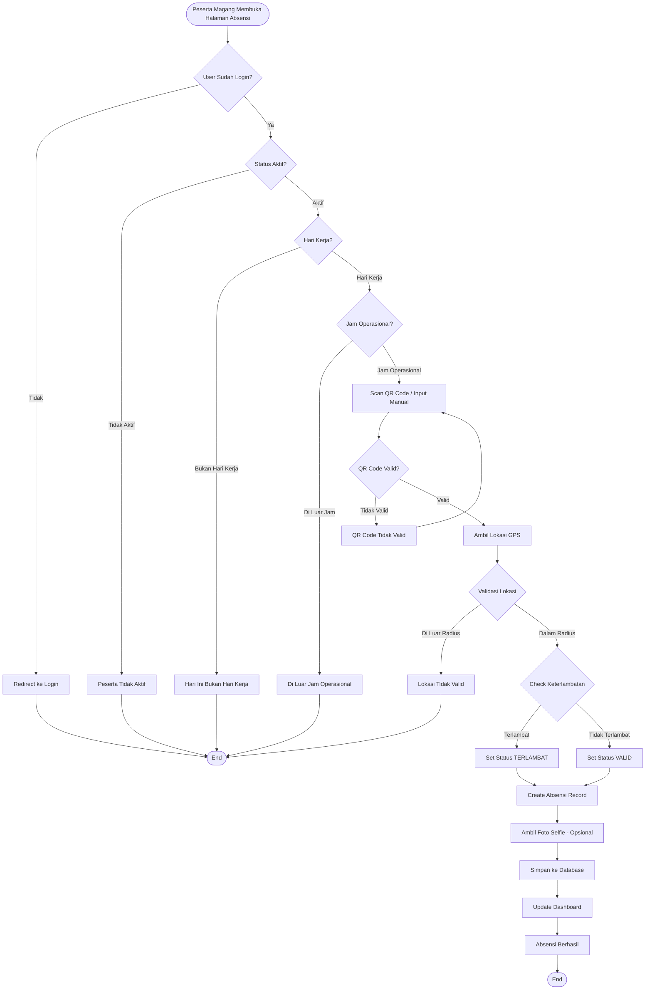

### 3. Activity Diagram: Proses Pengajuan Izin

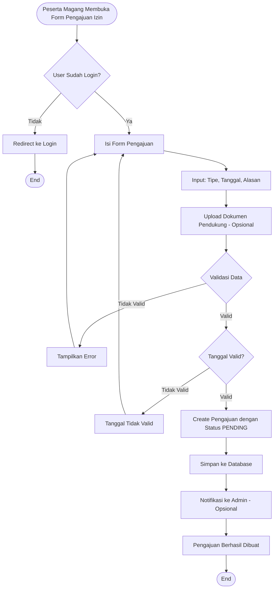

### 4. Activity Diagram: Proses Persetujuan Pengajuan Izin

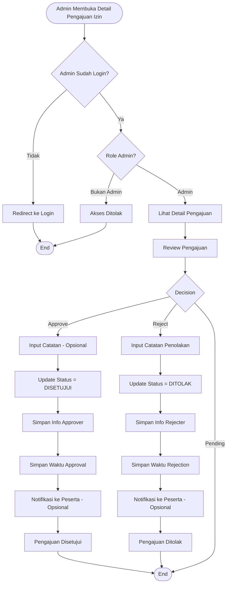

### 5. Activity Diagram: Proses Create Peserta Magang

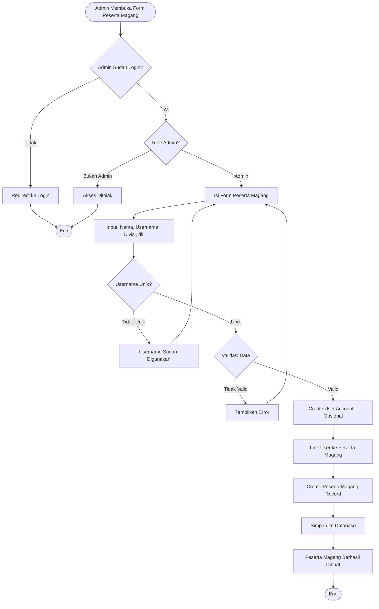

### 6. Activity Diagram: Proses View Dashboard

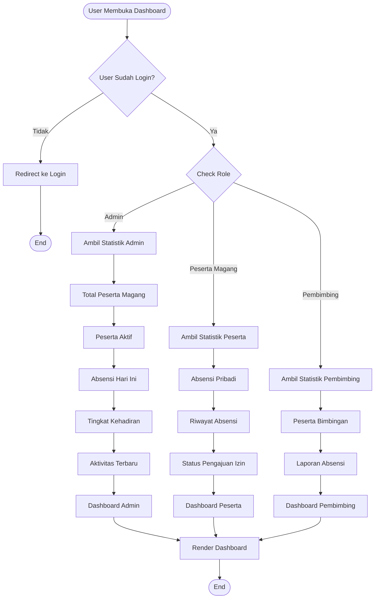

### 7. Activity Diagram: Proses Validasi Absensi

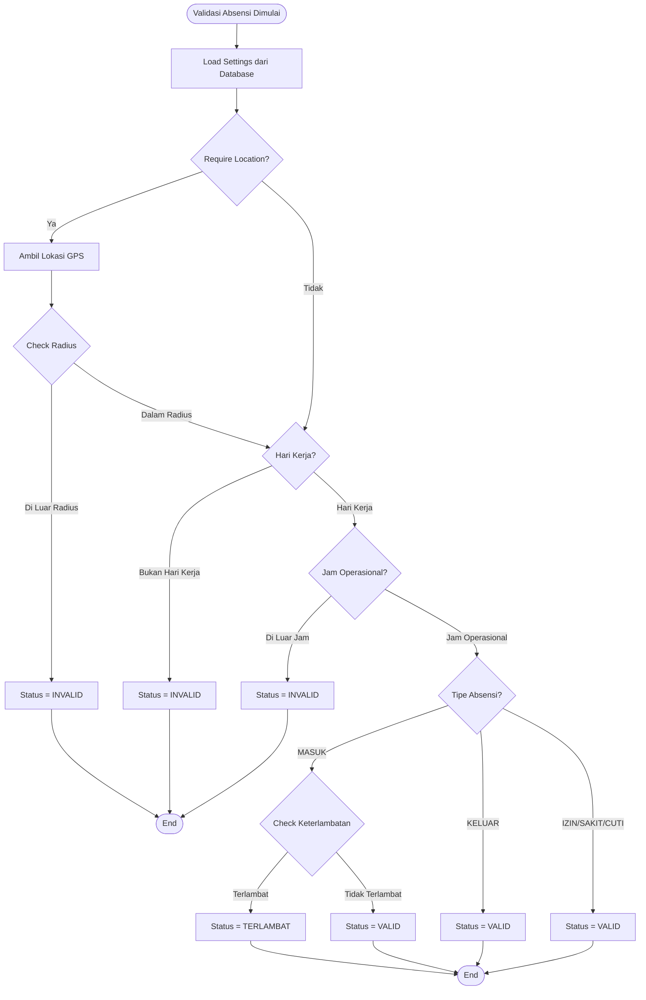

### 8. Activity Diagram: Proses Isi Logbook

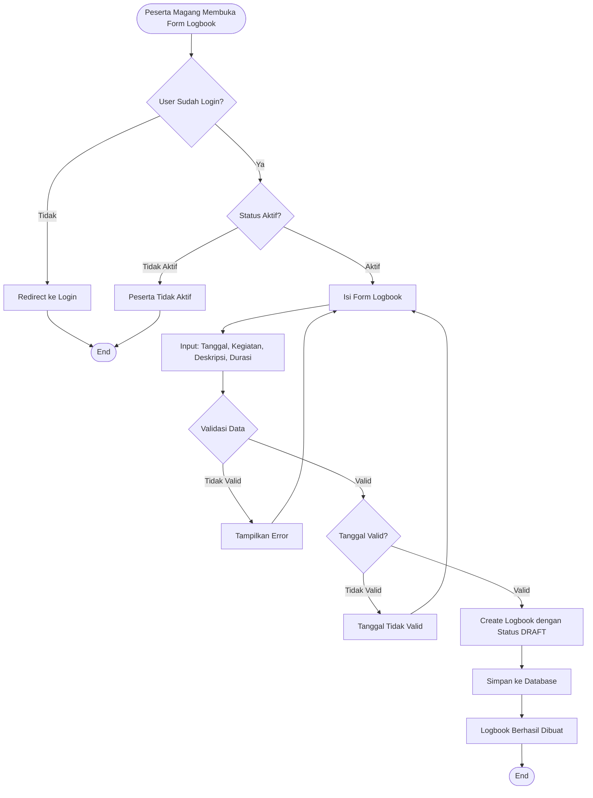

### 9. Activity Diagram: Proses Submit Logbook

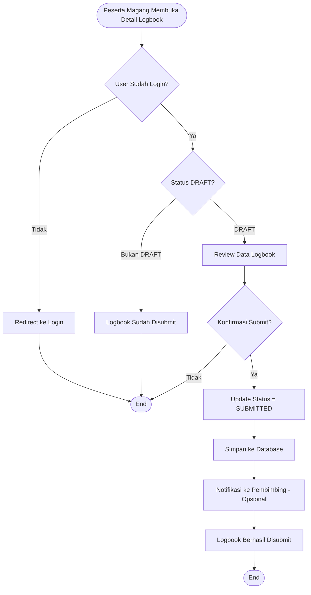

### 10. Activity Diagram: Proses Review Logbook (Pembimbing/Admin)

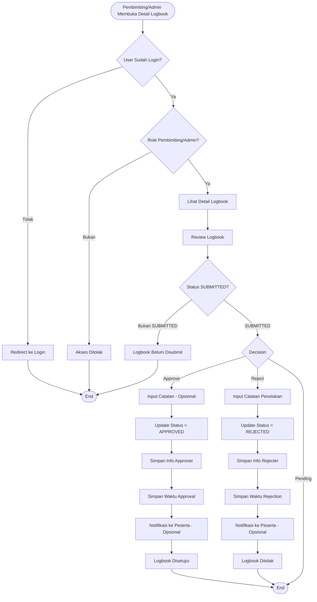

### 11. Activity Diagram: Proses Update Settings

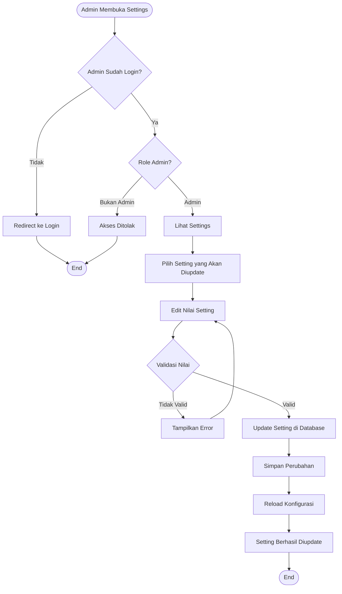

## 📊 Activity Summary

### Total Activities
- **Login Process**: 1 activity diagram
- **Absensi Process**: 2 activity diagrams (Masuk, Validasi)
- **Pengajuan Izin Process**: 2 activity diagrams (Create, Approval)
- **Logbook Process**: 3 activity diagrams (Isi, Submit, Review)
- **Management Process**: 2 activity diagrams (Create Peserta, Update Settings)
- **Dashboard Process**: 1 activity diagram

### Key Decision Points
1. **Authentication Checks**: Login status, role validation
2. **Data Validation**: Input validation, business rules
3. **Location Validation**: GPS radius check
4. **Time Validation**: Work day, work hours, late check
5. **Status Determination**: Valid, Invalid, Terlambat

### Common Patterns
- **Authentication First**: Semua activity dimulai dengan check login
- **Role-Based Access**: Admin-only activities check role
- **Validation Loops**: Error handling dengan kembali ke input
- **Database Operations**: Create, Read, Update operations
- **Status Updates**: Status changes dengan notifications

---

**Dibuat oleh**: Tim Development  
**Tanggal**: 2024  
**Versi**: 1.0.0

