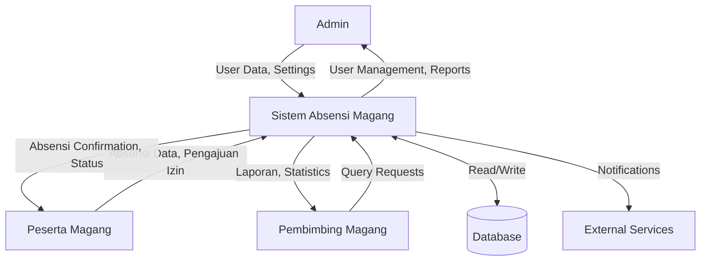
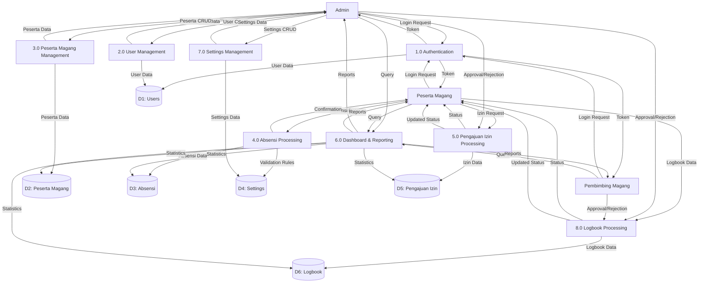
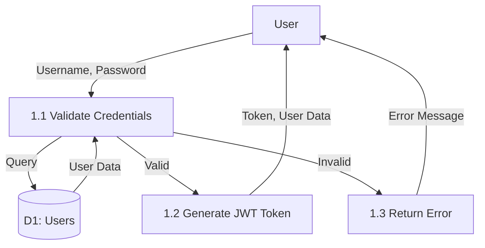
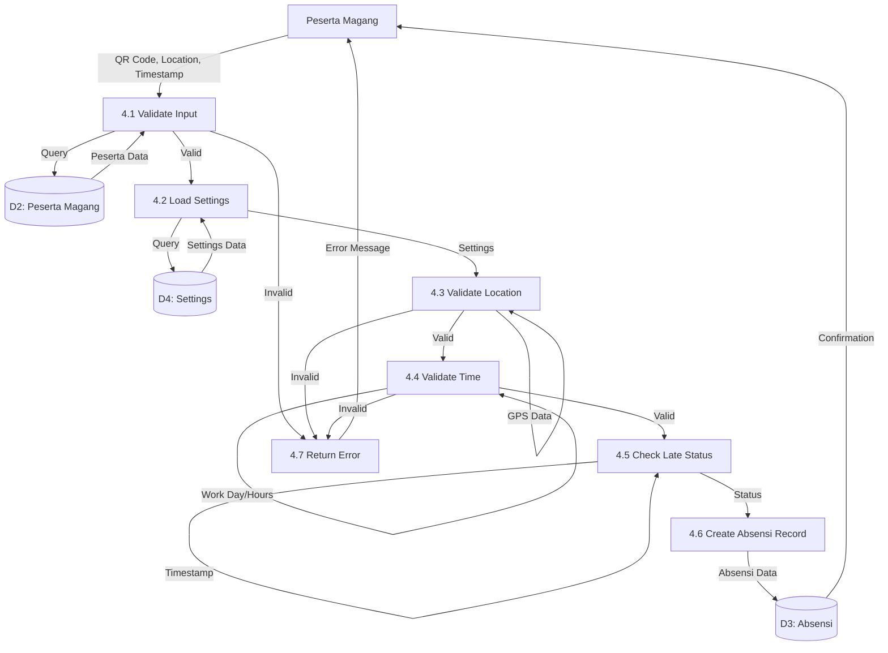
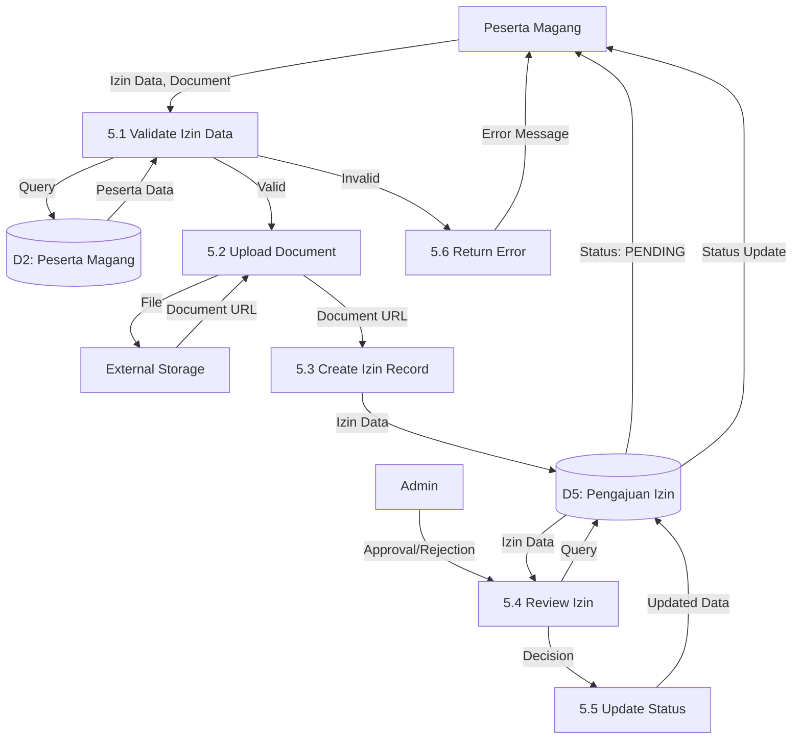
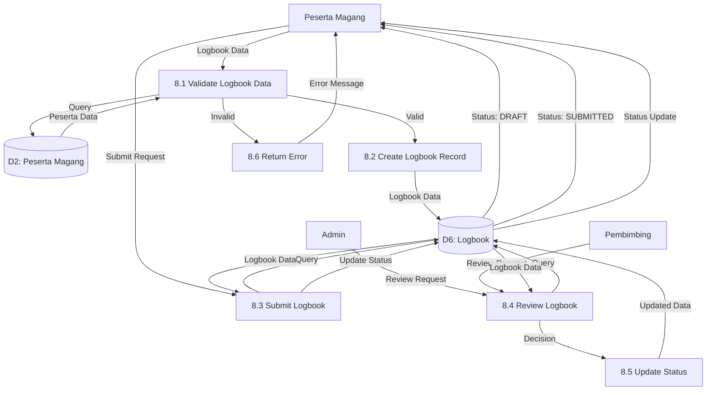
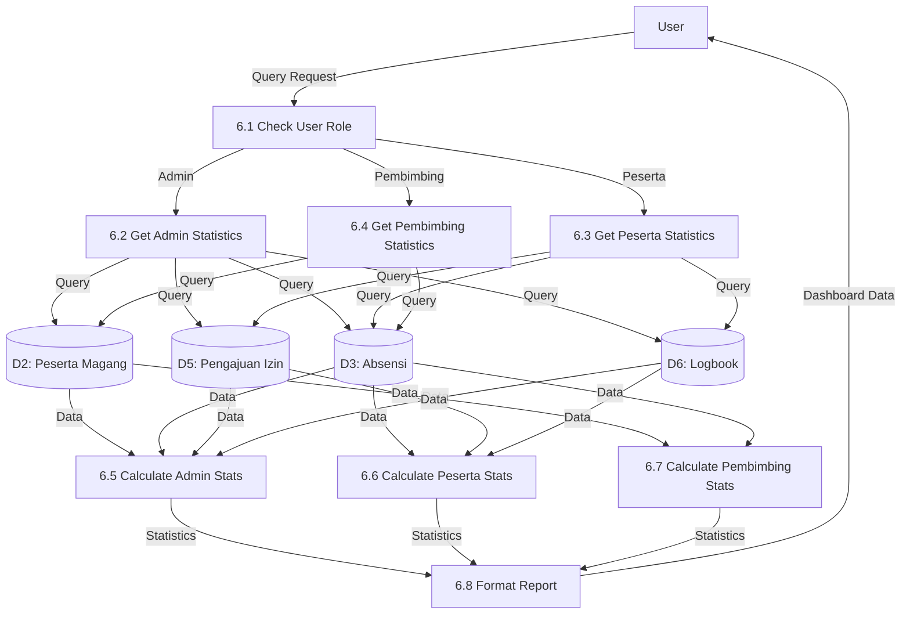

# Data Flow Diagram (DFD)
## Sistem Absensi Magang

## 📊 Overview
Dokumen ini menjelaskan Data Flow Diagram (DFD) untuk sistem absensi magang, menunjukkan alur data dari input hingga output.

## 🔄 DFD Levels

### DFD Level 0 (Context Diagram)

**Deskripsi**:
- **External Entities**: Admin, Peserta Magang, Pembimbing Magang, Database, External Services
- **System**: Sistem Absensi Magang (single process)
- **Data Flows**: User data, Absensi data, Reports, Settings, dll

### DFD Level 1 (Top Level)

**Data Stores**:
- **D1**: Users
- **D2**: Peserta Magang
- **D3**: Absensi
- **D4**: Settings
- **D5**: Pengajuan Izin
- **D6**: Logbook

### DFD Level 2: Authentication Process (1.0)

### DFD Level 2: Absensi Processing (4.0)

### DFD Level 2: Pengajuan Izin Processing (5.0)

### DFD Level 2: Logbook Processing (8.0)

### DFD Level 2: Dashboard & Reporting (6.0)

## 📊 Data Dictionary

### Data Stores

#### D1: Users
- **Description**: Menyimpan data pengguna sistem
- **Contents**: id, username, password, role, isActive, avatar, timestamps
- **Volume**: ~100-1000 records
- **Access**: Read/Write by Authentication & User Management

#### D2: Peserta Magang
- **Description**: Menyimpan data peserta magang
- **Contents**: id, nama, username, divisi, instansi, nomorHp, tanggal, status, timestamps
- **Volume**: ~50-500 records
- **Access**: Read/Write by Peserta Management & Absensi Processing

#### D3: Absensi
- **Description**: Menyimpan data absensi
- **Contents**: id, pesertaMagangId, tipe, timestamp, lokasi, selfieUrl, qrCodeData, status, timestamps
- **Volume**: ~1000-10000 records/month
- **Access**: Read/Write by Absensi Processing, Read by Dashboard

#### D4: Settings
- **Description**: Menyimpan konfigurasi sistem
- **Contents**: id, key, value (JSON), category, timestamps
- **Volume**: ~20-50 records
- **Access**: Read by Absensi Processing, Read/Write by Settings Management

#### D5: Pengajuan Izin
- **Description**: Menyimpan data pengajuan izin
- **Contents**: id, pesertaMagangId, tipe, tanggal, alasan, status, dokumen, approval info, timestamps
- **Volume**: ~100-1000 records/month
- **Access**: Read/Write by Izin Processing, Read by Dashboard

#### D6: Logbook
- **Description**: Menyimpan data logbook peserta magang
- **Contents**: id, pesertaMagangId, tanggal, kegiatan, deskripsi, durasi, status, catatan pembimbing, approval info, timestamps
- **Volume**: ~500-5000 records/month
- **Access**: Read/Write by Logbook Processing, Read by Dashboard

### Data Flows

#### User Data
- **From**: Admin, User Management
- **To**: Database (D1)
- **Contents**: User information (username, password, role, etc.)
- **Frequency**: Low (on user creation/update)

#### Absensi Data
- **From**: Peserta Magang, Absensi Processing
- **To**: Database (D3)
- **Contents**: Absensi information (tipe, timestamp, lokasi, status, etc.)
- **Frequency**: High (multiple times per day per user)

#### Settings Data
- **From**: Admin, Settings Management
- **To**: Database (D4)
- **Contents**: System configuration (work hours, location, security, etc.)
- **Frequency**: Low (on settings update)

#### Statistics Data
- **From**: Database (D2, D3, D5)
- **To**: Dashboard, Users
- **Contents**: Aggregated statistics (counts, percentages, trends)
- **Frequency**: Medium (on dashboard load)

## 🔍 Process Descriptions

### 1.0 Authentication
- **Input**: Username, Password
- **Output**: JWT Token, User Data / Error Message
- **Process**: Validate credentials, generate token
- **Data Stores**: D1 (Read)

### 2.0 User Management
- **Input**: User CRUD operations
- **Output**: User Data / Confirmation
- **Process**: Create, Read, Update, Delete users
- **Data Stores**: D1 (Read/Write)

### 3.0 Peserta Magang Management
- **Input**: Peserta CRUD operations
- **Output**: Peserta Data / Confirmation
- **Process**: Create, Read, Update, Delete peserta magang
- **Data Stores**: D2 (Read/Write)

### 4.0 Absensi Processing
- **Input**: QR Code, Location, Timestamp, Selfie
- **Output**: Absensi Confirmation / Error Message
- **Process**: Validate input, location, time, create record
- **Data Stores**: D2 (Read), D3 (Write), D4 (Read)

### 5.0 Pengajuan Izin Processing
- **Input**: Izin Data, Document
- **Output**: Izin Status / Error Message
- **Process**: Validate, create request, handle approval/rejection
- **Data Stores**: D2 (Read), D5 (Read/Write)

### 6.0 Dashboard & Reporting
- **Input**: Query Parameters, User Role
- **Output**: Statistics, Reports
- **Process**: Aggregate data, calculate statistics, format reports
- **Data Stores**: D2 (Read), D3 (Read), D5 (Read), D6 (Read)

### 7.0 Settings Management
- **Input**: Settings CRUD operations
- **Output**: Settings Data / Confirmation
- **Process**: Create, Read, Update settings
- **Data Stores**: D4 (Read/Write)

### 8.0 Logbook Processing
- **Input**: Logbook Data
- **Output**: Logbook Status / Error Message
- **Process**: Validate, create entry, handle submit, approval/rejection
- **Data Stores**: D2 (Read), D6 (Read/Write)

## 📈 Data Flow Summary

### Input Flows
- **User Input**: Login credentials, CRUD operations, Absensi data, Izin requests, Logbook data
- **System Input**: GPS location, Timestamp, QR code data

### Output Flows
- **User Output**: Tokens, Confirmations, Statistics, Reports, Error messages
- **System Output**: Database records, Notifications

### Internal Flows
- **Validation**: Input → Validation → Database
- **Processing**: Input → Business Logic → Database
- **Reporting**: Database → Aggregation → Statistics → Reports

---

**Dibuat oleh**: Tim Development  
**Tanggal**: 2024  
**Versi**: 1.0.0

