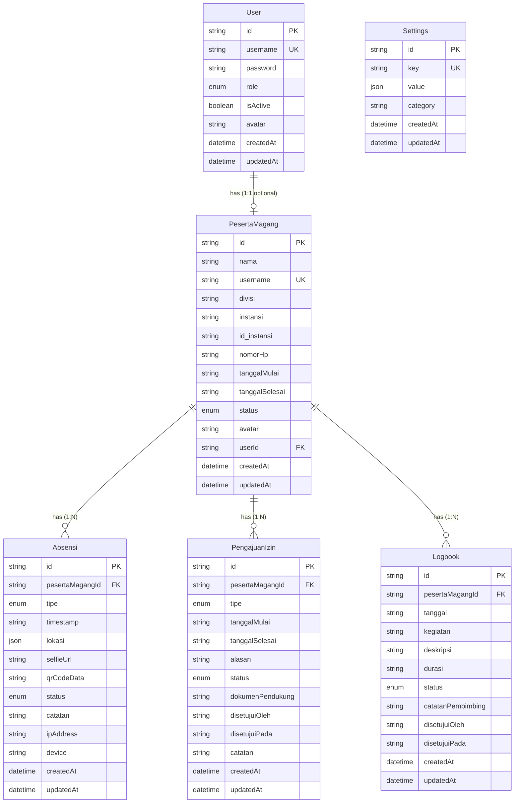

# Entity Relationship Diagram (ERD)
## Sistem Absensi Magang

## 📊 Overview
Dokumen ini menjelaskan struktur database dan relasi antar entitas dalam sistem absensi magang.

## 🗄️ Database Schema

### Entities (Tables)

#### 1. User
**Deskripsi**: Tabel untuk menyimpan data pengguna sistem
- `id` (String, PK): Unique identifier
- `username` (String, Unique): Username untuk login
- `password` (String): Password terenkripsi
- `role` (Enum: ADMIN, USER, PEMBIMBING_MAGANG): Role pengguna
- `isActive` (Boolean): Status aktif/nonaktif
- `avatar` (String, Optional): URL avatar
- `createdAt` (DateTime): Timestamp pembuatan
- `updatedAt` (DateTime): Timestamp update

**Relasi**:
- One-to-One dengan `PesertaMagang`

#### 2. PesertaMagang
**Deskripsi**: Tabel untuk menyimpan data peserta magang
- `id` (String, PK): Unique identifier
- `nama` (String): Nama lengkap
- `username` (String, Unique): Username unik
- `divisi` (String): Divisi tempat magang
- `instansi` (String): Nama instansi/universitas
- `id_instansi` (String, Optional): ID instansi
- `nomorHp` (String): Nomor telepon
- `tanggalMulai` (String): Tanggal mulai magang
- `tanggalSelesai` (String): Tanggal selesai magang
- `status` (Enum: AKTIF, NONAKTIF, SELESAI): Status peserta
- `avatar` (String, Optional): URL avatar
- `createdAt` (DateTime): Timestamp pembuatan
- `updatedAt` (DateTime): Timestamp update
- `userId` (String, FK, Optional): Foreign key ke User

**Relasi**:
- Many-to-One dengan `User` (optional)
- One-to-Many dengan `Absensi`
- One-to-Many dengan `PengajuanIzin`
- One-to-Many dengan `Logbook`

#### 3. Absensi
**Deskripsi**: Tabel untuk menyimpan data absensi peserta magang
- `id` (String, PK): Unique identifier
- `pesertaMagangId` (String, FK): Foreign key ke PesertaMagang
- `tipe` (Enum: MASUK, KELUAR, IZIN, SAKIT, CUTI): Tipe absensi
- `timestamp` (String): Waktu absensi
- `lokasi` (JSON, Optional): Data lokasi (latitude, longitude, alamat)
- `selfieUrl` (String, Optional): URL foto selfie
- `qrCodeData` (String, Optional): Data QR code yang di-scan
- `status` (Enum: VALID, INVALID, TERLAMBAT): Status absensi
- `catatan` (String, Optional): Catatan tambahan
- `ipAddress` (String, Optional): IP address saat absensi
- `device` (String, Optional): Informasi device
- `createdAt` (DateTime): Timestamp pembuatan
- `updatedAt` (DateTime): Timestamp update

**Relasi**:
- Many-to-One dengan `PesertaMagang`

#### 4. PengajuanIzin
**Deskripsi**: Tabel untuk menyimpan data pengajuan izin peserta magang
- `id` (String, PK): Unique identifier
- `pesertaMagangId` (String, FK): Foreign key ke PesertaMagang
- `tipe` (Enum: SAKIT, IZIN, CUTI): Tipe izin
- `tanggalMulai` (String): Tanggal mulai izin
- `tanggalSelesai` (String): Tanggal selesai izin
- `alasan` (String): Alasan pengajuan
- `status` (Enum: PENDING, DISETUJUI, DITOLAK): Status pengajuan
- `dokumenPendukung` (String, Optional): URL dokumen pendukung
- `disetujuiOleh` (String, Optional): User yang menyetujui
- `disetujuiPada` (String, Optional): Waktu persetujuan
- `catatan` (String, Optional): Catatan dari admin
- `createdAt` (DateTime): Timestamp pembuatan
- `updatedAt` (DateTime): Timestamp update

**Relasi**:
- Many-to-One dengan `PesertaMagang`

#### 5. Logbook
**Deskripsi**: Tabel untuk menyimpan data logbook peserta magang
- `id` (String, PK): Unique identifier
- `pesertaMagangId` (String, FK): Foreign key ke PesertaMagang
- `tanggal` (String): Tanggal kegiatan
- `kegiatan` (String): Nama/judul kegiatan
- `deskripsi` (String): Deskripsi detail kegiatan yang dilakukan
- `durasi` (String, Optional): Durasi kegiatan (dalam jam)
- `status` (Enum: DRAFT, SUBMITTED, APPROVED, REJECTED): Status logbook
- `catatanPembimbing` (String, Optional): Catatan dari pembimbing
- `disetujuiOleh` (String, Optional): User yang menyetujui
- `disetujuiPada` (String, Optional): Waktu persetujuan
- `createdAt` (DateTime): Timestamp pembuatan
- `updatedAt` (DateTime): Timestamp update

**Relasi**:
- Many-to-One dengan `PesertaMagang`

#### 6. Settings
**Deskripsi**: Tabel untuk menyimpan konfigurasi sistem
- `id` (String, PK): Unique identifier
- `key` (String, Unique): Key setting
- `value` (JSON): Nilai setting (dapat berupa berbagai tipe)
- `category` (String): Kategori setting
- `createdAt` (DateTime): Timestamp pembuatan
- `updatedAt` (DateTime): Timestamp update

**Relasi**:
- Tidak ada relasi dengan tabel lain (standalone)

## 🔗 Entity Relationships

### Relationship Diagram (Mermaid)

## 📝 Relationship Details

### 1. User ↔ PesertaMagang
- **Type**: One-to-One (Optional)
- **Cardinality**: 1:0..1
- **Description**: Satu User dapat memiliki satu PesertaMagang (opsional)
- **Foreign Key**: `PesertaMagang.userId` → `User.id`
- **Cascade**: ON DELETE CASCADE (jika User dihapus, PesertaMagang juga dihapus)

### 2. PesertaMagang ↔ Absensi
- **Type**: One-to-Many
- **Cardinality**: 1:N
- **Description**: Satu PesertaMagang dapat memiliki banyak Absensi
- **Foreign Key**: `Absensi.pesertaMagangId` → `PesertaMagang.id`
- **Cascade**: ON DELETE CASCADE (jika PesertaMagang dihapus, semua Absensi terkait dihapus)

### 3. PesertaMagang ↔ PengajuanIzin
- **Type**: One-to-Many
- **Cardinality**: 1:N
- **Description**: Satu PesertaMagang dapat memiliki banyak PengajuanIzin
- **Foreign Key**: `PengajuanIzin.pesertaMagangId` → `PesertaMagang.id`
- **Cascade**: ON DELETE CASCADE (jika PesertaMagang dihapus, semua PengajuanIzin terkait dihapus)

### 4. PesertaMagang ↔ Logbook
- **Type**: One-to-Many
- **Cardinality**: 1:N
- **Description**: Satu PesertaMagang dapat memiliki banyak Logbook
- **Foreign Key**: `Logbook.pesertaMagangId` → `PesertaMagang.id`
- **Cascade**: ON DELETE CASCADE (jika PesertaMagang dihapus, semua Logbook terkait dihapus)

## 🎯 Enums

### Role
- `ADMIN`: Administrator sistem
- `USER`: User biasa
- `PEMBIMBING_MAGANG`: Pembimbing magang

### StatusPeserta
- `AKTIF`: Peserta aktif
- `NONAKTIF`: Peserta nonaktif
- `SELESAI`: Peserta sudah selesai magang

### TipeAbsensi
- `MASUK`: Absensi masuk
- `KELUAR`: Absensi keluar
- `IZIN`: Absensi dengan izin
- `SAKIT`: Absensi sakit
- `CUTI`: Absensi cuti

### StatusAbsensi
- `VALID`: Absensi valid
- `INVALID`: Absensi tidak valid
- `TERLAMBAT`: Absensi terlambat

### TipeIzin
- `SAKIT`: Izin sakit
- `IZIN`: Izin biasa
- `CUTI`: Cuti

### StatusPengajuan
- `PENDING`: Menunggu persetujuan
- `DISETUJUI`: Disetujui
- `DITOLAK`: Ditolak

### StatusLogbook
- `DRAFT`: Draft (belum disubmit)
- `SUBMITTED`: Sudah disubmit, menunggu review
- `APPROVED`: Disetujui oleh pembimbing
- `REJECTED`: Ditolak oleh pembimbing

## 🔍 Indexes

### Unique Indexes
- `User.username` (Unique)
- `PesertaMagang.username` (Unique)
- `PesertaMagang.userId` (Unique, Optional)
- `Settings.key` (Unique)

### Foreign Key Indexes
- `PesertaMagang.userId` → `User.id`
- `Absensi.pesertaMagangId` → `PesertaMagang.id`
- `PengajuanIzin.pesertaMagangId` → `PesertaMagang.id`
- `Logbook.pesertaMagangId` → `PesertaMagang.id`

## 📊 Database Statistics

- **Total Tables**: 6
- **Total Relationships**: 4
- **Total Enums**: 7
- **Database**: PostgreSQL
- **ORM**: Prisma

## 🔐 Constraints

1. **Cascade Delete**: 
   - User deletion → PesertaMagang deletion
   - PesertaMagang deletion → Absensi, PengajuanIzin & Logbook deletion

2. **Unique Constraints**:
   - Username must be unique per table
   - Settings key must be unique

3. **Required Fields**:
   - Most fields are required except optional ones marked with `?`

---

**Dibuat oleh**: Tim Development  
**Tanggal**: 2024  
**Versi**: 1.0.0

