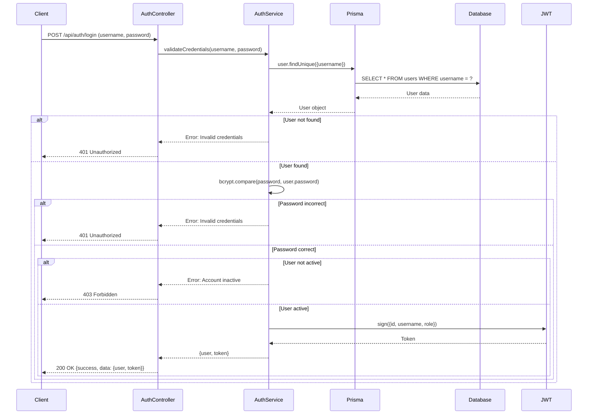
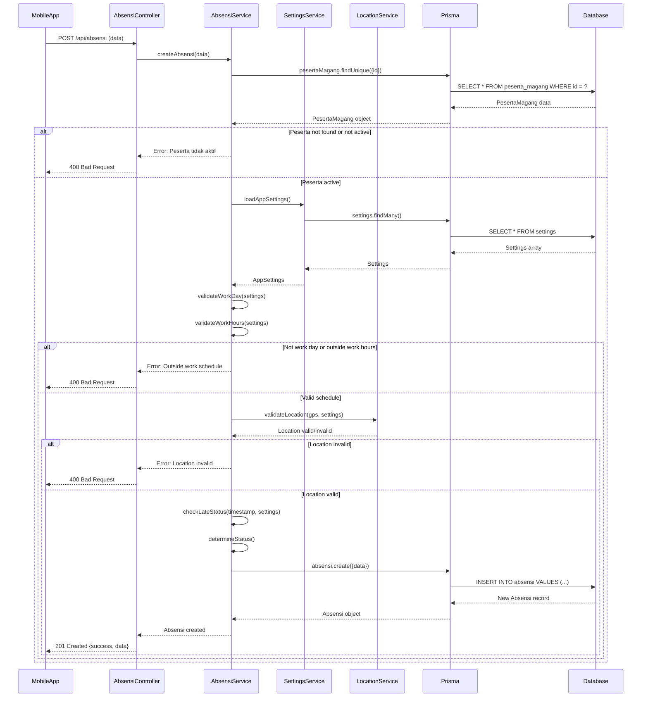
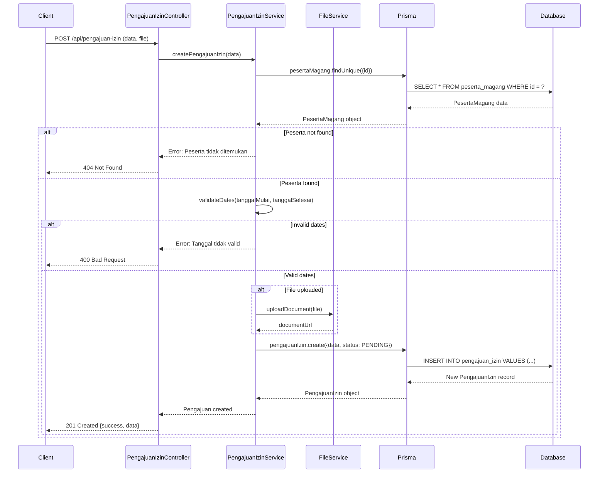
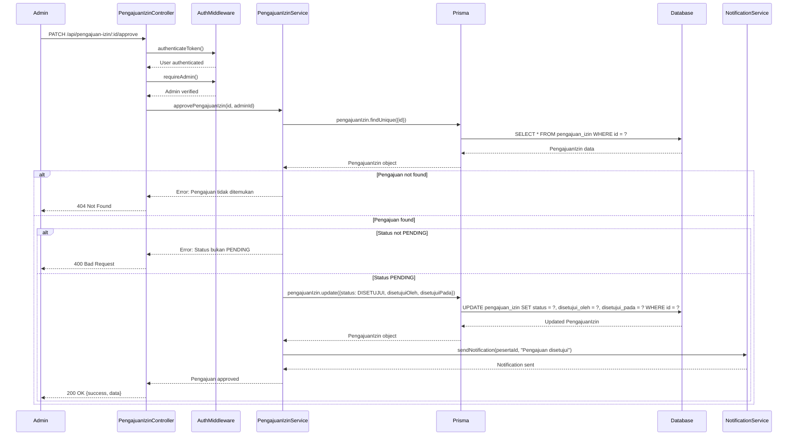
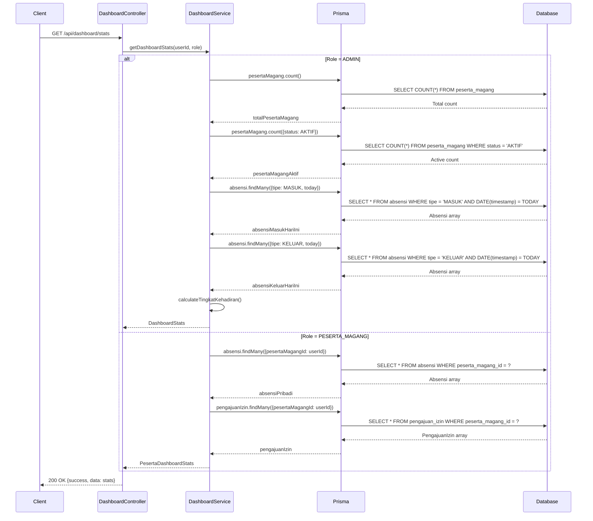
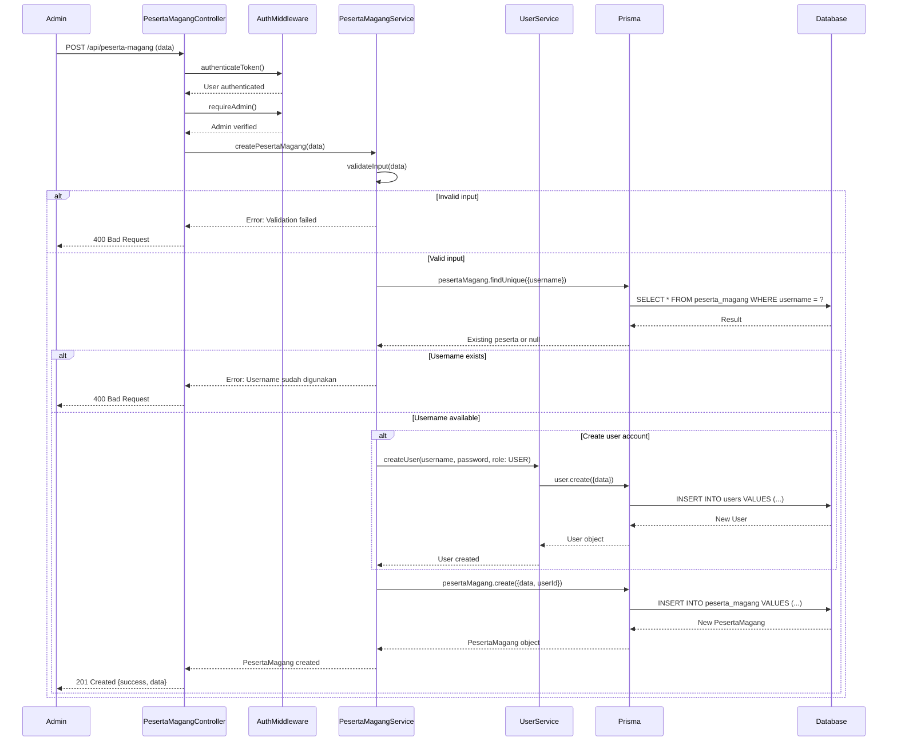
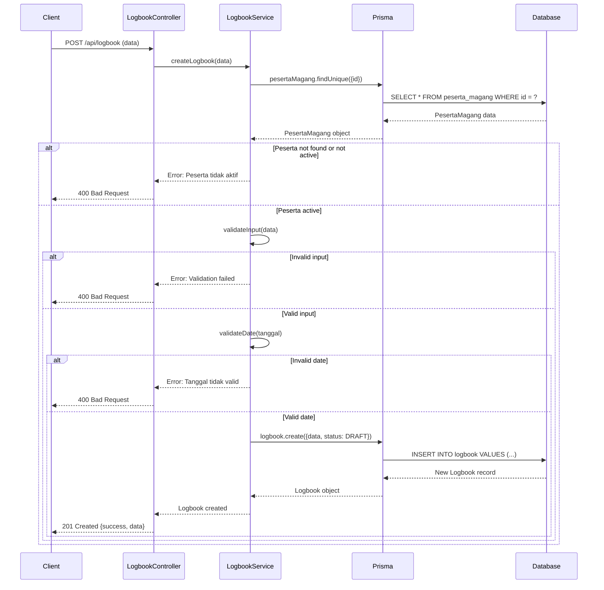
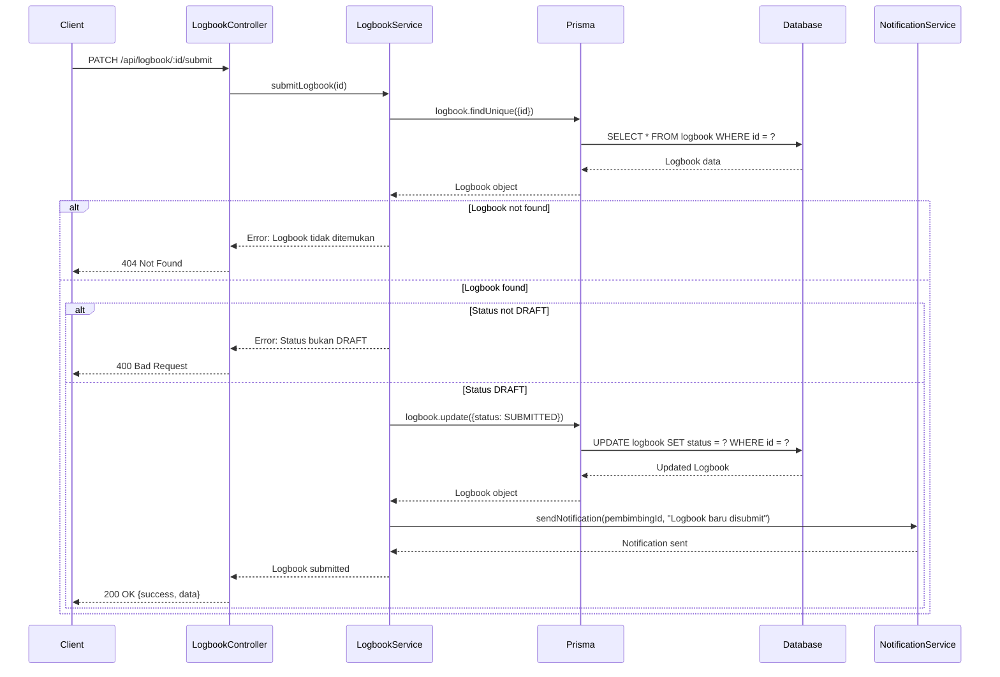
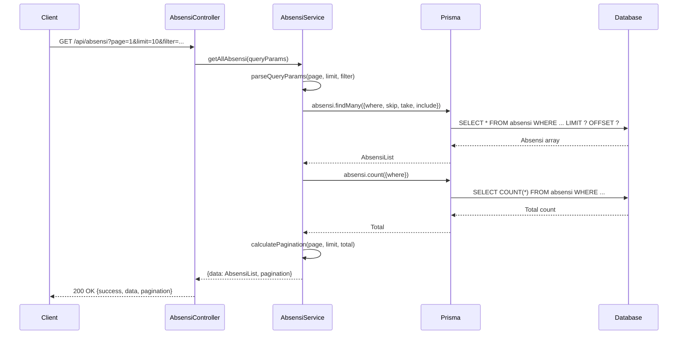

# Sequence Diagram
## Sistem Absensi Magang

## 📊 Overview
Dokumen ini menjelaskan sequence diagram untuk interaksi antar komponen dalam sistem absensi magang.

## 🔄 Sequence Diagrams

### 1. Sequence Diagram: Login Process

### 2. Sequence Diagram: Absensi Masuk Process

### 3. Sequence Diagram: Create Pengajuan Izin Process

### 4. Sequence Diagram: Approve Pengajuan Izin Process

### 5. Sequence Diagram: Get Dashboard Statistics

### 6. Sequence Diagram: Create Peserta Magang (Admin)

### 7. Sequence Diagram: Create Logbook Process

### 8. Sequence Diagram: Submit Logbook Process

### 9. Sequence Diagram: Get All Absensi with Pagination

## 📊 Sequence Diagram Summary

### Total Sequence Diagrams: 9

1. **Login Process**: Authentication flow dengan JWT
2. **Absensi Masuk**: Complete absensi creation dengan validasi
3. **Create Pengajuan Izin**: Izin request creation
4. **Approve Pengajuan Izin**: Approval workflow
5. **Get Dashboard Statistics**: Role-based statistics retrieval
6. **Create Peserta Magang**: Admin creation dengan user account linking
7. **Create Logbook**: Logbook entry creation
8. **Submit Logbook**: Logbook submission untuk review
9. **Get All Absensi**: Pagination dan filtering

### Key Components

- **Controllers**: Handle HTTP requests/responses
- **Services**: Business logic layer
- **Middleware**: Authentication & authorization
- **Prisma**: ORM layer
- **Database**: PostgreSQL database
- **External Services**: JWT, FileService, NotificationService, LocationService

### Common Patterns

1. **Authentication First**: Semua protected endpoints check auth
2. **Role-Based Access**: Admin-only endpoints check role
3. **Validation**: Input validation sebelum database operations
4. **Error Handling**: Proper error responses
5. **Database Transactions**: Atomic operations
6. **Pagination**: For list endpoints

---

**Dibuat oleh**: Tim Development  
**Tanggal**: 2024  
**Versi**: 1.0.0

