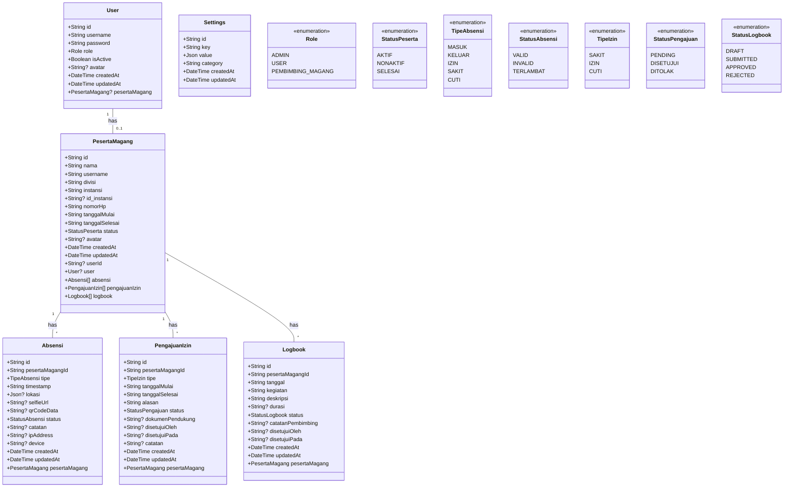

# UML Class Diagram
## Sistem Absensi Magang

## 📊 Overview
Dokumen ini menjelaskan struktur class dan model dalam sistem absensi magang menggunakan UML Class Diagram.

## 🏗️ Class Structure

### Class Diagram (Mermaid)

## 📦 Class Descriptions

### 1. User
**Deskripsi**: Class untuk representasi pengguna sistem

**Attributes**:
- `id: String` - Unique identifier
- `username: String` - Username untuk login
- `password: String` - Password terenkripsi
- `role: Role` - Role pengguna (enum)
- `isActive: Boolean` - Status aktif/nonaktif
- `avatar: String?` - URL avatar (optional)
- `createdAt: DateTime` - Timestamp pembuatan
- `updatedAt: DateTime` - Timestamp update

**Relationships**:
- `pesertaMagang: PesertaMagang?` - One-to-One optional relationship

**Methods** (implied from controllers):
- `login()` - Authenticate user
- `register()` - Register new user
- `updateProfile()` - Update user profile
- `uploadAvatar()` - Upload avatar image

### 2. PesertaMagang
**Deskripsi**: Class untuk representasi peserta magang

**Attributes**:
- `id: String` - Unique identifier
- `nama: String` - Nama lengkap
- `username: String` - Username unik
- `divisi: String` - Divisi tempat magang
- `instansi: String` - Nama instansi/universitas
- `id_instansi: String?` - ID instansi (optional)
- `nomorHp: String` - Nomor telepon
- `tanggalMulai: String` - Tanggal mulai magang
- `tanggalSelesai: String` - Tanggal selesai magang
- `status: StatusPeserta` - Status peserta (enum)
- `avatar: String?` - URL avatar (optional)
- `createdAt: DateTime` - Timestamp pembuatan
- `updatedAt: DateTime` - Timestamp update
- `userId: String?` - Foreign key ke User (optional)

**Relationships**:
- `user: User?` - One-to-One optional relationship
- `absensi: Absensi[]` - One-to-Many relationship
- `pengajuanIzin: PengajuanIzin[]` - One-to-Many relationship
- `logbook: Logbook[]` - One-to-Many relationship

**Methods** (implied from controllers):
- `create()` - Create new peserta magang
- `getAll()` - Get all peserta magang
- `getById()` - Get peserta magang by ID
- `update()` - Update peserta magang
- `delete()` - Delete peserta magang

### 3. Absensi
**Deskripsi**: Class untuk representasi data absensi

**Attributes**:
- `id: String` - Unique identifier
- `pesertaMagangId: String` - Foreign key ke PesertaMagang
- `tipe: TipeAbsensi` - Tipe absensi (enum)
- `timestamp: String` - Waktu absensi
- `lokasi: Json?` - Data lokasi (optional)
- `selfieUrl: String?` - URL foto selfie (optional)
- `qrCodeData: String?` - Data QR code (optional)
- `status: StatusAbsensi` - Status absensi (enum)
- `catatan: String?` - Catatan tambahan (optional)
- `ipAddress: String?` - IP address (optional)
- `device: String?` - Informasi device (optional)
- `createdAt: DateTime` - Timestamp pembuatan
- `updatedAt: DateTime` - Timestamp update

**Relationships**:
- `pesertaMagang: PesertaMagang` - Many-to-One relationship

**Methods** (implied from controllers):
- `create()` - Create new absensi
- `getAll()` - Get all absensi
- `getById()` - Get absensi by ID
- `update()` - Update absensi
- `delete()` - Delete absensi

### 4. PengajuanIzin
**Deskripsi**: Class untuk representasi pengajuan izin

**Attributes**:
- `id: String` - Unique identifier
- `pesertaMagangId: String` - Foreign key ke PesertaMagang
- `tipe: TipeIzin` - Tipe izin (enum)
- `tanggalMulai: String` - Tanggal mulai izin
- `tanggalSelesai: String` - Tanggal selesai izin
- `alasan: String` - Alasan pengajuan
- `status: StatusPengajuan` - Status pengajuan (enum)
- `dokumenPendukung: String?` - URL dokumen (optional)
- `disetujuiOleh: String?` - User yang menyetujui (optional)
- `disetujuiPada: String?` - Waktu persetujuan (optional)
- `catatan: String?` - Catatan dari admin (optional)
- `createdAt: DateTime` - Timestamp pembuatan
- `updatedAt: DateTime` - Timestamp update

**Relationships**:
- `pesertaMagang: PesertaMagang` - Many-to-One relationship

**Methods** (implied from controllers):
- `create()` - Create new pengajuan izin
- `getAll()` - Get all pengajuan izin
- `getById()` - Get pengajuan izin by ID
- `update()` - Update pengajuan izin
- `delete()` - Delete pengajuan izin
- `approve()` - Approve pengajuan izin
- `reject()` - Reject pengajuan izin

### 5. Logbook
**Deskripsi**: Class untuk representasi logbook peserta magang

**Attributes**:
- `id: String` - Unique identifier
- `pesertaMagangId: String` - Foreign key ke PesertaMagang
- `tanggal: String` - Tanggal kegiatan
- `kegiatan: String` - Nama/judul kegiatan
- `deskripsi: String` - Deskripsi detail kegiatan
- `durasi: String?` - Durasi kegiatan dalam jam (optional)
- `status: StatusLogbook` - Status logbook (enum)
- `catatanPembimbing: String?` - Catatan dari pembimbing (optional)
- `disetujuiOleh: String?` - User yang menyetujui (optional)
- `disetujuiPada: String?` - Waktu persetujuan (optional)
- `createdAt: DateTime` - Timestamp pembuatan
- `updatedAt: DateTime` - Timestamp update

**Relationships**:
- `pesertaMagang: PesertaMagang` - Many-to-One relationship

**Methods** (implied from controllers):
- `create()` - Create new logbook entry
- `getAll()` - Get all logbook entries
- `getById()` - Get logbook by ID
- `update()` - Update logbook entry
- `delete()` - Delete logbook entry
- `submit()` - Submit logbook for review
- `approve()` - Approve logbook (by pembimbing/admin)
- `reject()` - Reject logbook (by pembimbing/admin)

### 6. Settings
**Deskripsi**: Class untuk representasi konfigurasi sistem

**Attributes**:
- `id: String` - Unique identifier
- `key: String` - Key setting (unique)
- `value: Json` - Nilai setting
- `category: String` - Kategori setting
- `createdAt: DateTime` - Timestamp pembuatan
- `updatedAt: DateTime` - Timestamp update

**Relationships**:
- Tidak ada relasi dengan class lain

**Methods** (implied from controllers):
- `getAll()` - Get all settings
- `getByKey()` - Get setting by key
- `update()` - Update setting
- `create()` - Create new setting

## 🔢 Enumerations

### Role
- `ADMIN` - Administrator sistem
- `USER` - User biasa
- `PEMBIMBING_MAGANG` - Pembimbing magang

### StatusPeserta
- `AKTIF` - Peserta aktif
- `NONAKTIF` - Peserta nonaktif
- `SELESAI` - Peserta sudah selesai magang

### TipeAbsensi
- `MASUK` - Absensi masuk
- `KELUAR` - Absensi keluar
- `IZIN` - Absensi dengan izin
- `SAKIT` - Absensi sakit
- `CUTI` - Absensi cuti

### StatusAbsensi
- `VALID` - Absensi valid
- `INVALID` - Absensi tidak valid
- `TERLAMBAT` - Absensi terlambat

### TipeIzin
- `SAKIT` - Izin sakit
- `IZIN` - Izin biasa
- `CUTI` - Cuti

### StatusPengajuan
- `PENDING` - Menunggu persetujuan
- `DISETUJUI` - Disetujui
- `DITOLAK` - Ditolak

### StatusLogbook
- `DRAFT` - Draft (belum disubmit)
- `SUBMITTED` - Sudah disubmit, menunggu review
- `APPROVED` - Disetujui oleh pembimbing
- `REJECTED` - Ditolak oleh pembimbing

## 🔗 Relationship Details

### 1. User ↔ PesertaMagang
- **Type**: One-to-One (Optional)
- **Multiplicity**: 1:0..1
- **Description**: Satu User dapat memiliki maksimal satu PesertaMagang

### 2. PesertaMagang ↔ Absensi
- **Type**: One-to-Many
- **Multiplicity**: 1:*
- **Description**: Satu PesertaMagang dapat memiliki banyak Absensi

### 3. PesertaMagang ↔ PengajuanIzin
- **Type**: One-to-Many
- **Multiplicity**: 1:*
- **Description**: Satu PesertaMagang dapat memiliki banyak PengajuanIzin

### 4. PesertaMagang ↔ Logbook
- **Type**: One-to-Many
- **Multiplicity**: 1:*
- **Description**: Satu PesertaMagang dapat memiliki banyak Logbook

## 🎯 Design Patterns

1. **Repository Pattern**: Data access melalui Prisma ORM
2. **Service Layer**: Business logic di controllers
3. **DTO Pattern**: Request/Response types untuk API
4. **Singleton Pattern**: Prisma client instance

## 📊 Class Statistics

- **Total Classes**: 6 main classes
- **Total Enumerations**: 7 enums
- **Total Relationships**: 4 relationships
- **Total Attributes**: ~50 attributes across all classes

---

**Dibuat oleh**: Tim Development  
**Tanggal**: 2024  
**Versi**: 1.0.0

