# Use Case Diagram (UCD)
## Sistem Absensi Magang

## 📊 Overview
Dokumen ini menjelaskan use case diagram untuk sistem absensi magang, mencakup semua aktor dan use case yang tersedia.

## 👥 Actors

### 1. Admin
**Deskripsi**: Administrator sistem dengan akses penuh
- Mengelola user
- Mengelola peserta magang
- Mengelola absensi
- Mengelola pengajuan izin
- Mengelola settings
- Melihat dashboard dan laporan

### 2. Peserta Magang
**Deskripsi**: Peserta magang yang menggunakan sistem
- Melakukan absensi (masuk/keluar)
- Melihat riwayat absensi
- Mengajukan izin
- Mengisi logbook
- Melihat profil
- Melihat dashboard pribadi

### 3. Pembimbing Magang
**Deskripsi**: Pembimbing yang memantau peserta magang
- Melihat data peserta magang
- Melihat laporan absensi
- Melihat dan review logbook
- Melihat dashboard

### 4. System
**Deskripsi**: Sistem itu sendiri (untuk proses otomatis)
- Validasi absensi
- Notifikasi
- Generate laporan

## 🎯 Use Cases

### Use Case Diagram (Mermaid)

```mermaid
graph TB
    subgraph "Authentication"
        UC1[Login]
        UC2[Register]
        UC3[Logout]
        UC4[Refresh Token]
    end
    
    subgraph "User Management"
        UC5[Create User]
        UC6[View Users]
        UC7[Update User]
        UC8[Delete User]
        UC9[Update Profile]
        UC10[Upload Avatar]
    end
    
    subgraph "Peserta Magang Management"
        UC11[Create Peserta Magang]
        UC12[View Peserta Magang]
        UC13[Update Peserta Magang]
        UC14[Delete Peserta Magang]
        UC15[View Peserta Magang Detail]
    end
    
    subgraph "Absensi"
        UC16[Absensi Masuk]
        UC17[Absensi Keluar]
        UC18[View Riwayat Absensi]
        UC19[View Absensi Detail]
        UC20[Update Absensi]
        UC21[Delete Absensi]
        UC22[Scan QR Code]
    end
    
    subgraph "Pengajuan Izin"
        UC23[Create Pengajuan Izin]
        UC24[View Pengajuan Izin]
        UC25[Approve Pengajuan Izin]
        UC26[Reject Pengajuan Izin]
        UC27[Update Pengajuan Izin]
        UC28[Delete Pengajuan Izin]
    end
    
    subgraph "Dashboard & Laporan"
        UC29[View Dashboard]
        UC30[View Laporan Absensi]
        UC31[View Statistics]
        UC32[Export Laporan]
    end
    
    subgraph "Logbook"
        UC36[Create Logbook]
        UC37[View Logbook]
        UC38[Update Logbook]
        UC39[Delete Logbook]
        UC40[Submit Logbook]
        UC41[Approve Logbook]
        UC42[Reject Logbook]
    end
    
    subgraph "Settings"
        UC33[View Settings]
        UC34[Update Settings]
        UC35[Create Settings]
    end
    
    Admin --> UC1
    Admin --> UC2
    Admin --> UC3
    Admin --> UC5
    Admin --> UC6
    Admin --> UC7
    Admin --> UC8
    Admin --> UC11
    Admin --> UC12
    Admin --> UC13
    Admin --> UC14
    Admin --> UC20
    Admin --> UC21
    Admin --> UC25
    Admin --> UC26
    Admin --> UC27
    Admin --> UC28
    Admin --> UC29
    Admin --> UC30
    Admin --> UC31
    Admin --> UC32
    Admin --> UC33
    Admin --> UC34
    Admin --> UC35
    Admin --> UC37
    Admin --> UC41
    Admin --> UC42
    
    PembimbingMagang --> UC37
    PembimbingMagang --> UC41
    PembimbingMagang --> UC42
    
    PesertaMagang --> UC1
    PesertaMagang --> UC3
    PesertaMagang --> UC4
    PesertaMagang --> UC9
    PesertaMagang --> UC10
    PesertaMagang --> UC16
    PesertaMagang --> UC17
    PesertaMagang --> UC18
    PesertaMagang --> UC19
    PesertaMagang --> UC22
    PesertaMagang --> UC23
    PesertaMagang --> UC24
    PesertaMagang --> UC36
    PesertaMagang --> UC37
    PesertaMagang --> UC38
    PesertaMagang --> UC39
    PesertaMagang --> UC40
    PesertaMagang --> UC29
    
    PembimbingMagang --> UC1
    PembimbingMagang --> UC3
    PesertaMagang --> UC12
    PesertaMagang --> UC15
    PesertaMagang --> UC18
    PesertaMagang --> UC30
    PesertaMagang --> UC31
    PesertaMagang --> UC29
    
    System --> UC16
    System --> UC17
```

## 📋 Detailed Use Cases

### Authentication Use Cases

#### UC1: Login
- **Actor**: Admin, Peserta Magang, Pembimbing Magang
- **Precondition**: User memiliki akun
- **Main Flow**:
  1. User memasukkan username dan password
  2. System memvalidasi kredensial
  3. System generate JWT token
  4. System mengembalikan token dan user data
- **Postcondition**: User berhasil login dan mendapatkan token

#### UC2: Register
- **Actor**: Admin
- **Precondition**: Admin sudah login
- **Main Flow**:
  1. Admin mengisi form registrasi
  2. System memvalidasi data
  3. System membuat user baru
  4. System mengembalikan data user
- **Postcondition**: User baru berhasil dibuat

#### UC3: Logout
- **Actor**: Admin, Peserta Magang, Pembimbing Magang
- **Precondition**: User sudah login
- **Main Flow**:
  1. User memilih logout
  2. System invalidate token
  3. System mengembalikan konfirmasi
- **Postcondition**: User berhasil logout

### User Management Use Cases

#### UC5: Create User
- **Actor**: Admin
- **Precondition**: Admin sudah login
- **Main Flow**:
  1. Admin mengisi form user baru
  2. System memvalidasi data
  3. System membuat user baru
  4. System mengembalikan data user
- **Postcondition**: User baru berhasil dibuat

#### UC6: View Users
- **Actor**: Admin
- **Precondition**: Admin sudah login
- **Main Flow**:
  1. Admin membuka halaman user management
  2. System mengambil data users dengan pagination
  3. System menampilkan list users
- **Postcondition**: List users ditampilkan

### Peserta Magang Management Use Cases

#### UC11: Create Peserta Magang
- **Actor**: Admin
- **Precondition**: Admin sudah login
- **Main Flow**:
  1. Admin mengisi form peserta magang
  2. System memvalidasi data
  3. System membuat peserta magang baru
  4. System mengembalikan data peserta magang
- **Postcondition**: Peserta magang baru berhasil dibuat

#### UC12: View Peserta Magang
- **Actor**: Admin, Pembimbing Magang
- **Precondition**: User sudah login
- **Main Flow**:
  1. User membuka halaman peserta magang
  2. System mengambil data dengan filter dan pagination
  3. System menampilkan list peserta magang
- **Postcondition**: List peserta magang ditampilkan

### Absensi Use Cases

#### UC16: Absensi Masuk
- **Actor**: Peserta Magang
- **Precondition**: Peserta magang sudah login dan aktif
- **Main Flow**:
  1. Peserta magang membuka halaman absensi
  2. Peserta magang scan QR code atau input manual
  3. System memvalidasi lokasi (jika diperlukan)
  4. System memvalidasi waktu (jam kerja)
  5. System memvalidasi hari kerja
  6. System membuat record absensi masuk
  7. System mengembalikan konfirmasi
- **Postcondition**: Absensi masuk berhasil dicatat

#### UC17: Absensi Keluar
- **Actor**: Peserta Magang
- **Precondition**: Peserta magang sudah login dan sudah absensi masuk
- **Main Flow**:
  1. Peserta magang membuka halaman absensi
  2. Peserta magang scan QR code atau input manual
  3. System memvalidasi lokasi (jika diperlukan)
  4. System memvalidasi waktu (jam kerja)
  5. System membuat record absensi keluar
  6. System mengembalikan konfirmasi
- **Postcondition**: Absensi keluar berhasil dicatat

#### UC22: Scan QR Code
- **Actor**: Peserta Magang
- **Precondition**: Peserta magang sudah login
- **Main Flow**:
  1. Peserta magang membuka scanner QR code
  2. Peserta magang scan QR code
  3. System memvalidasi QR code data
  4. System memproses absensi berdasarkan QR code
  5. System mengembalikan hasil
- **Postcondition**: QR code berhasil di-scan dan diproses

### Pengajuan Izin Use Cases

#### UC23: Create Pengajuan Izin
- **Actor**: Peserta Magang
- **Precondition**: Peserta magang sudah login
- **Main Flow**:
  1. Peserta magang mengisi form pengajuan izin
  2. Peserta magang upload dokumen pendukung (opsional)
  3. System memvalidasi data
  4. System membuat pengajuan izin dengan status PENDING
  5. System mengembalikan konfirmasi
- **Postcondition**: Pengajuan izin berhasil dibuat

#### UC25: Approve Pengajuan Izin
- **Actor**: Admin
- **Precondition**: Admin sudah login, ada pengajuan izin dengan status PENDING
- **Main Flow**:
  1. Admin membuka detail pengajuan izin
  2. Admin review pengajuan
  3. Admin memilih approve
  4. System update status menjadi DISETUJUI
  5. System menyimpan informasi admin yang approve
  6. System mengembalikan konfirmasi
- **Postcondition**: Pengajuan izin berhasil disetujui

#### UC26: Reject Pengajuan Izin
- **Actor**: Admin
- **Precondition**: Admin sudah login, ada pengajuan izin dengan status PENDING
- **Main Flow**:
  1. Admin membuka detail pengajuan izin
  2. Admin review pengajuan
  3. Admin memilih reject dan menambahkan catatan
  4. System update status menjadi DITOLAK
  5. System menyimpan catatan penolakan
  6. System mengembalikan konfirmasi
- **Postcondition**: Pengajuan izin berhasil ditolak

### Logbook Use Cases

#### UC36: Create Logbook
- **Actor**: Peserta Magang
- **Precondition**: Peserta magang sudah login
- **Main Flow**:
  1. Peserta magang membuka form logbook
  2. Peserta magang mengisi form (tanggal, kegiatan, deskripsi, durasi)
  3. System memvalidasi data
  4. System membuat logbook dengan status DRAFT
  5. System mengembalikan konfirmasi
- **Postcondition**: Logbook berhasil dibuat dengan status DRAFT

#### UC37: View Logbook
- **Actor**: Peserta Magang, Admin, Pembimbing Magang
- **Precondition**: User sudah login
- **Main Flow**:
  1. User membuka halaman logbook
  2. System mengambil data logbook dengan filter dan pagination
  3. System menampilkan list logbook
- **Postcondition**: List logbook ditampilkan

#### UC38: Update Logbook
- **Actor**: Peserta Magang
- **Precondition**: Peserta magang sudah login, logbook dengan status DRAFT
- **Main Flow**:
  1. Peserta magang membuka detail logbook
  2. Peserta magang mengedit data logbook
  3. System memvalidasi data
  4. System update logbook
  5. System mengembalikan konfirmasi
- **Postcondition**: Logbook berhasil diupdate

#### UC39: Delete Logbook
- **Actor**: Peserta Magang
- **Precondition**: Peserta magang sudah login, logbook dengan status DRAFT
- **Main Flow**:
  1. Peserta magang membuka detail logbook
  2. Peserta magang memilih delete
  3. System menghapus logbook
  4. System mengembalikan konfirmasi
- **Postcondition**: Logbook berhasil dihapus

#### UC40: Submit Logbook
- **Actor**: Peserta Magang
- **Precondition**: Peserta magang sudah login, logbook dengan status DRAFT
- **Main Flow**:
  1. Peserta magang membuka detail logbook
  2. Peserta magang memilih submit
  3. System update status menjadi SUBMITTED
  4. System mengembalikan konfirmasi
- **Postcondition**: Logbook berhasil disubmit untuk review

#### UC41: Approve Logbook
- **Actor**: Admin, Pembimbing Magang
- **Precondition**: User sudah login, ada logbook dengan status SUBMITTED
- **Main Flow**:
  1. User membuka detail logbook
  2. User review logbook
  3. User memilih approve
  4. System update status menjadi APPROVED
  5. System menyimpan informasi user yang approve
  6. System mengembalikan konfirmasi
- **Postcondition**: Logbook berhasil disetujui

#### UC42: Reject Logbook
- **Actor**: Admin, Pembimbing Magang
- **Precondition**: User sudah login, ada logbook dengan status SUBMITTED
- **Main Flow**:
  1. User membuka detail logbook
  2. User review logbook
  3. User memilih reject dan menambahkan catatan
  4. System update status menjadi REJECTED
  5. System menyimpan catatan penolakan
  6. System mengembalikan konfirmasi
- **Postcondition**: Logbook berhasil ditolak

### Dashboard & Laporan Use Cases

#### UC29: View Dashboard
- **Actor**: Admin, Peserta Magang, Pembimbing Magang
- **Precondition**: User sudah login
- **Main Flow**:
  1. User membuka halaman dashboard
  2. System mengambil statistik berdasarkan role
  3. System menampilkan dashboard dengan data statistik
- **Postcondition**: Dashboard ditampilkan dengan data terkini

#### UC30: View Laporan Absensi
- **Actor**: Admin, Pembimbing Magang
- **Precondition**: User sudah login
- **Main Flow**:
  1. User membuka halaman laporan
  2. User memilih filter (periode, peserta, dll)
  3. System mengambil data absensi sesuai filter
  4. System menampilkan laporan
- **Postcondition**: Laporan absensi ditampilkan

### Settings Use Cases

#### UC33: View Settings
- **Actor**: Admin
- **Precondition**: Admin sudah login
- **Main Flow**:
  1. Admin membuka halaman settings
  2. System mengambil semua settings
  3. System menampilkan settings berdasarkan kategori
- **Postcondition**: Settings ditampilkan

#### UC34: Update Settings
- **Actor**: Admin
- **Precondition**: Admin sudah login
- **Main Flow**:
  1. Admin membuka halaman settings
  2. Admin memilih setting yang akan diupdate
  3. Admin mengubah nilai setting
  4. System memvalidasi data
  5. System update setting
  6. System mengembalikan konfirmasi
- **Postcondition**: Setting berhasil diupdate

## 🔗 Use Case Relationships

### Include Relationships
- **UC16 (Absensi Masuk) includes UC22 (Scan QR Code)**: Absensi masuk dapat menggunakan scan QR code
- **UC17 (Absensi Keluar) includes UC22 (Scan QR Code)**: Absensi keluar dapat menggunakan scan QR code

### Extend Relationships
- **UC16 (Absensi Masuk) extends UC29 (View Dashboard)**: Setelah absensi masuk, dashboard dapat diupdate
- **UC17 (Absensi Keluar) extends UC29 (View Dashboard)**: Setelah absensi keluar, dashboard dapat diupdate

## 📊 Use Case Statistics

- **Total Use Cases**: 42
- **Total Actors**: 4
- **Admin Use Cases**: 28
- **Peserta Magang Use Cases**: 17
- **Pembimbing Magang Use Cases**: 11
- **System Use Cases**: 2

---

**Dibuat oleh**: Tim Development  
**Tanggal**: 2024  
**Versi**: 1.0.0

