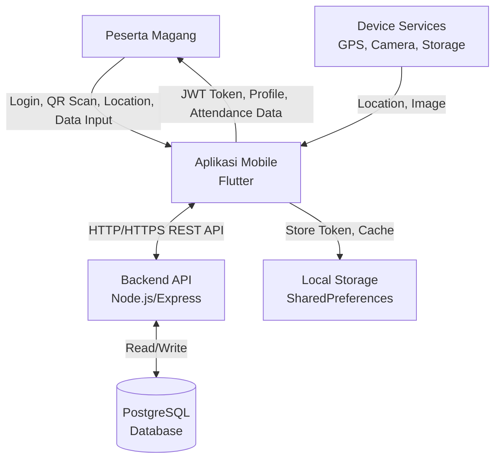
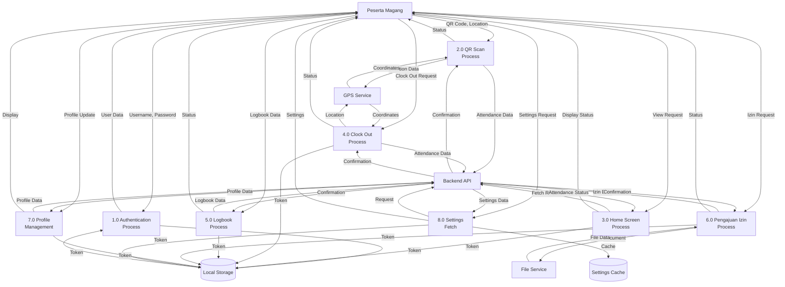
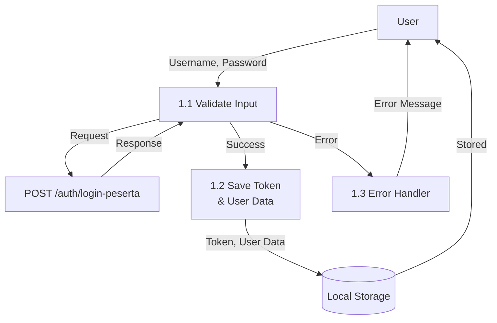
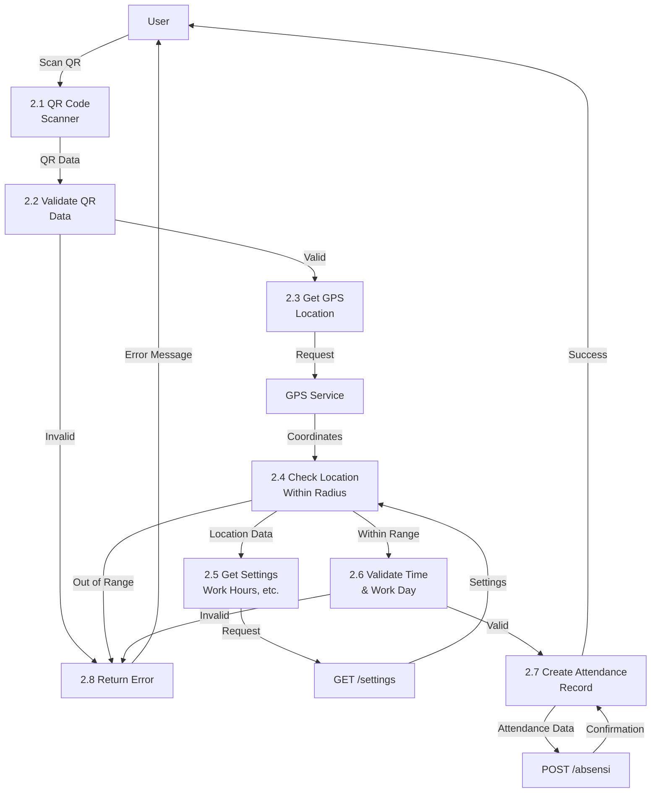
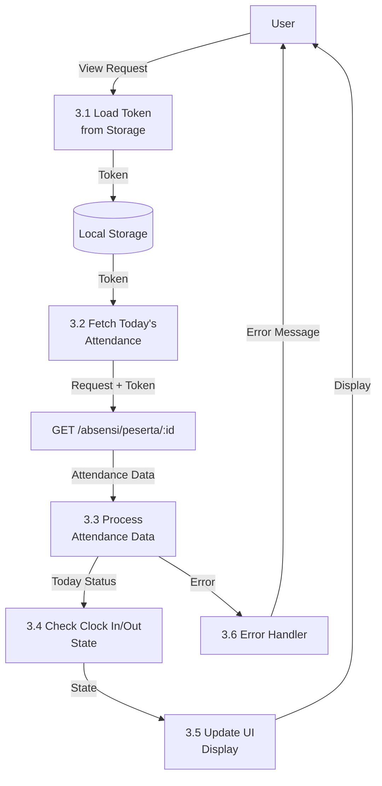
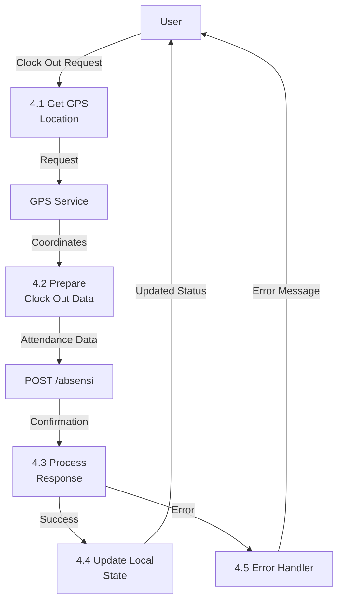
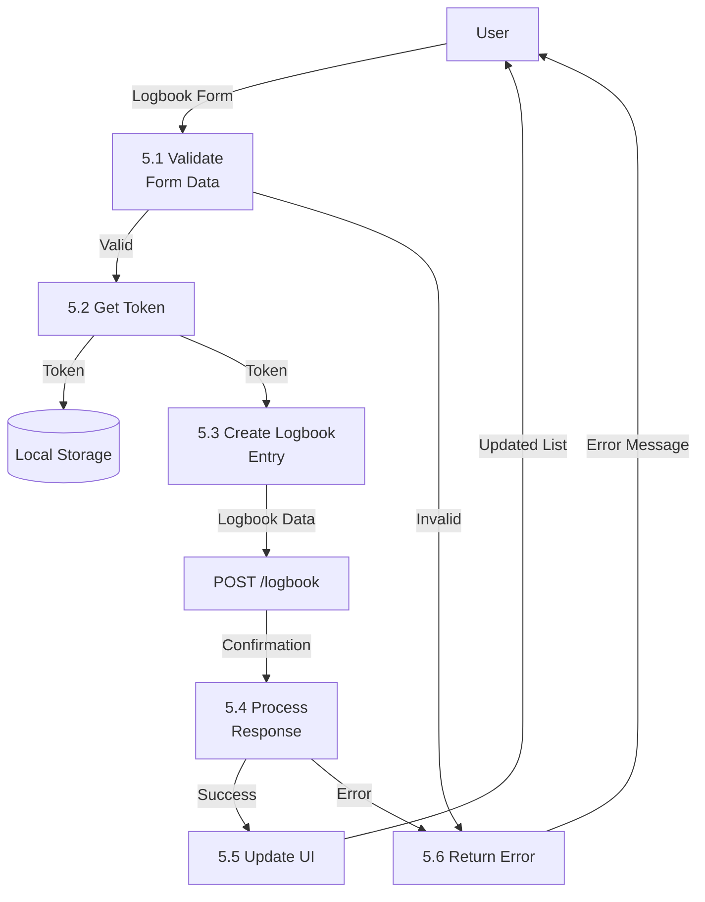
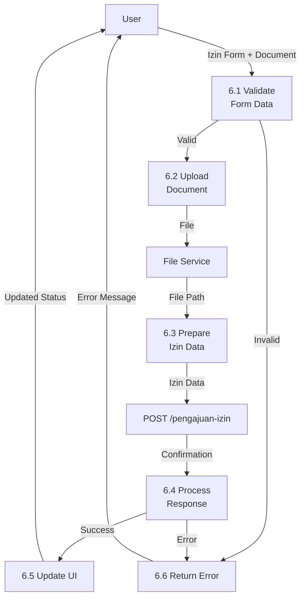

# Data Flow Diagram (DFD) - Mobile Application
## Sistem Absensi Magang - Aplikasi Mobile (Flutter)

## 📊 Overview
Dokumen ini menjelaskan Data Flow Diagram (DFD) khusus untuk aplikasi mobile (Flutter), menunjukkan alur data dari input user hingga output dan interaksi dengan backend API.

## 🔄 DFD Levels

### DFD Level 0 (Context Diagram) - Mobile App

**Deskripsi**:
- **External Entities**: Peserta Magang, Backend API, Database, Device Services, Local Storage
- **System**: Aplikasi Mobile Flutter
- **Data Flows**: Login credentials, QR code, GPS location, attendance data, API responses

### DFD Level 1 - Mobile Application Processes

### DFD Level 2: Authentication Process (1.0)

### DFD Level 2: QR Scan & Clock In Process (2.0)

### DFD Level 2: Home Screen Process (3.0)

### DFD Level 2: Clock Out Process (4.0)

### DFD Level 2: Logbook Process (5.0)

### DFD Level 2: Pengajuan Izin Process (6.0)

## 📊 Data Dictionary

### Data Stores

#### Local Storage
- **Description**: Local storage menggunakan SharedPreferences (Flutter)
- **Contents**: 
  - `auth_token`: JWT token
  - `user_data`: User profile data (JSON)
  - `theme_mode`: Theme preference
  - `onboard_seen`: Onboarding status
- **Volume**: ~10-50 KB
- **Access**: Read/Write by all processes

#### Settings Cache
- **Description**: Cache untuk settings dari backend
- **Contents**: Settings data (work hours, location, etc.)
- **Volume**: ~5-10 KB
- **Access**: Read by QR Scan & Clock Out processes, Write by Settings Fetch

### Data Flows

#### Authentication Data
- **From**: User → Authentication Process
- **To**: Backend API → Local Storage
- **Contents**: Username, Password → JWT Token, User Data
- **Frequency**: Once per login session

#### QR Scan Data
- **From**: QR Scanner → QR Scan Process
- **To**: Backend API
- **Contents**: QR code data, GPS coordinates, timestamp
- **Frequency**: Multiple times per day (max once per day for clock-in)

#### Attendance Data
- **From**: Backend API → Home Screen Process
- **To**: User Display
- **Contents**: Today's attendance status, clock-in/out times
- **Frequency**: On app open, after clock-in/out

#### Location Data
- **From**: GPS Service → QR Scan/Clock Out Processes
- **To**: Backend API
- **Contents**: Latitude, Longitude, Address
- **Frequency**: On every clock-in/out

## 🔍 Process Descriptions

### 1.0 Authentication Process
- **Input**: Username, Password
- **Output**: JWT Token, User Data / Error Message
- **Process**: Validate credentials dengan backend, save token locally
- **Data Stores**: Local Storage (Write)

### 2.0 QR Scan & Clock In Process
- **Input**: QR Code, GPS Location
- **Output**: Attendance Confirmation / Error Message
- **Process**: Scan QR, validate location, check work hours, create attendance record
- **Data Stores**: Settings Cache (Read), Backend API (Write)

### 3.0 Home Screen Process
- **Input**: View Request
- **Output**: Today's Attendance Status
- **Process**: Fetch today's attendance from backend, process and display
- **Data Stores**: Local Storage (Read), Backend API (Read)

### 4.0 Clock Out Process
- **Input**: Clock Out Request, GPS Location
- **Output**: Clock Out Confirmation / Error Message
- **Process**: Get location, create clock-out attendance record
- **Data Stores**: Backend API (Write)

### 5.0 Logbook Process
- **Input**: Logbook Form Data
- **Output**: Logbook Entry Confirmation / Error Message
- **Process**: Validate form, create logbook entry via API
- **Data Stores**: Backend API (Write)

### 6.0 Pengajuan Izin Process
- **Input**: Izin Form Data, Document
- **Output**: Izin Request Confirmation / Error Message
- **Process**: Validate form, upload document, create izin request via API
- **Data Stores**: File Service (Write), Backend API (Write)

### 7.0 Profile Management
- **Input**: Profile Update Request
- **Output**: Updated Profile Data
- **Process**: Fetch/update profile via API, update local storage
- **Data Stores**: Local Storage (Read/Write), Backend API (Read/Write)

### 8.0 Settings Fetch
- **Input**: Settings Request
- **Output**: Settings Data
- **Process**: Fetch settings from API, cache locally
- **Data Stores**: Settings Cache (Write), Backend API (Read)

## 📱 Mobile-Specific Features

### Offline Capability
- **Token Storage**: Token disimpan di local storage untuk offline authentication
- **Cache**: Settings di-cache untuk mengurangi API calls
- **Error Handling**: Graceful error handling dengan retry mechanism

### Device Integration
- **GPS Service**: Integrasi dengan device GPS untuk location tracking
- **Camera Service**: QR code scanning menggunakan device camera
- **Storage Service**: Local file storage untuk dokumen pendukung

### State Management
- **Providers**: Flutter Provider untuk state management
- **Refresh Logic**: Auto-refresh attendance status saat app dibuka
- **Day Change Detection**: Auto-reset state saat pergantian hari

---

**Dibuat oleh**: Tim Development  
**Tanggal**: 2024  
**Versi**: 1.0.0  
**Platform**: Flutter Mobile Application

