# Data Flow Diagram (DFD) - Web Application
## Sistem Absensi Magang - Aplikasi Web (React)

## 📊 Overview
Dokumen ini menjelaskan Data Flow Diagram (DFD) khusus untuk aplikasi web (React), menunjukkan alur data dari input admin hingga output dan interaksi dengan backend API.

## 🔄 DFD Levels

### DFD Level 0 (Context Diagram) - Web App

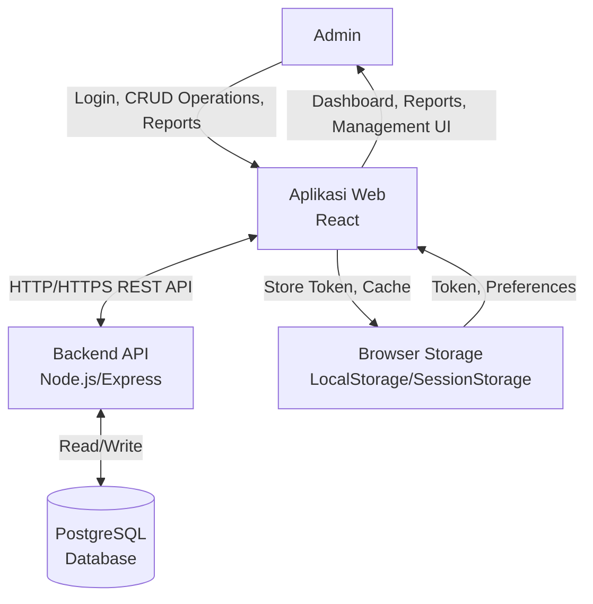

**Deskripsi**:
- **External Entities**: Admin, Backend API, Database, Browser Storage
- **System**: Aplikasi Web React
- **Data Flows**: Login credentials, CRUD operations, report requests, API responses

### DFD Level 1 - Web Application Processes

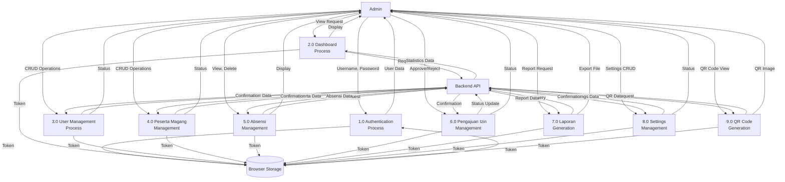

### DFD Level 2: Authentication Process (1.0)

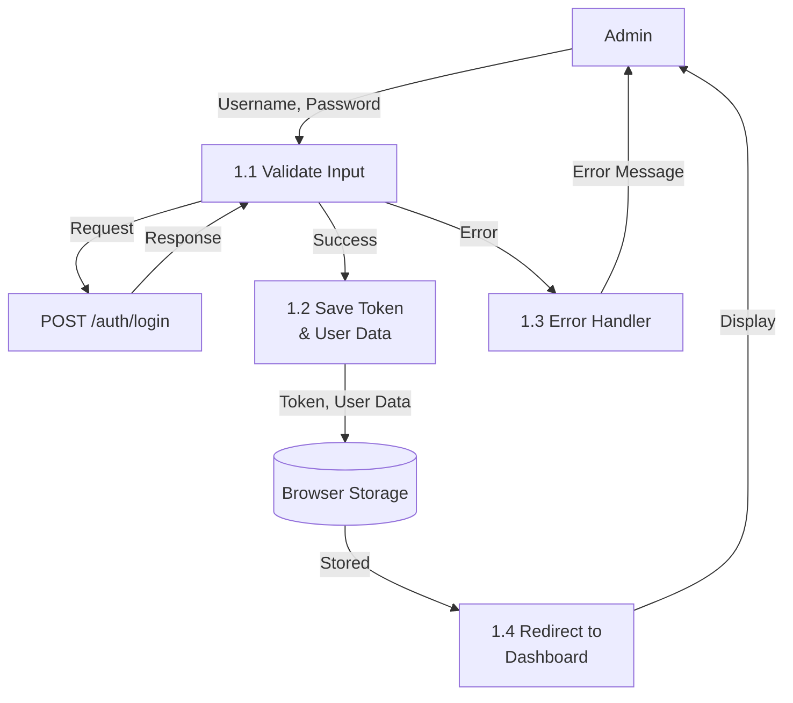

### DFD Level 2: Dashboard Process (2.0)

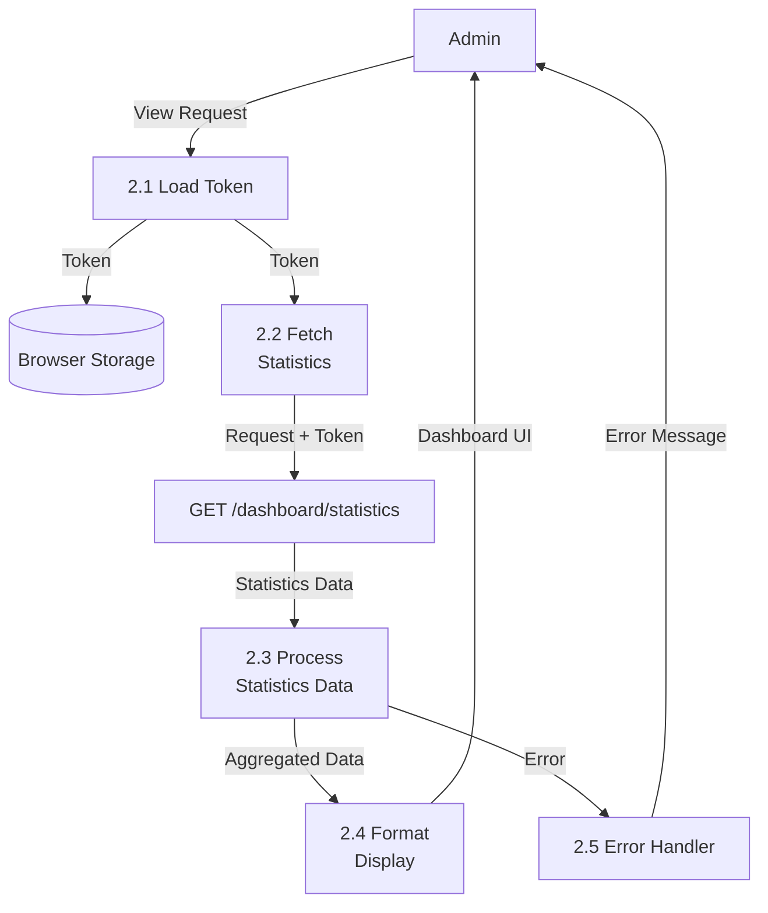

### DFD Level 2: User Management Process (3.0)

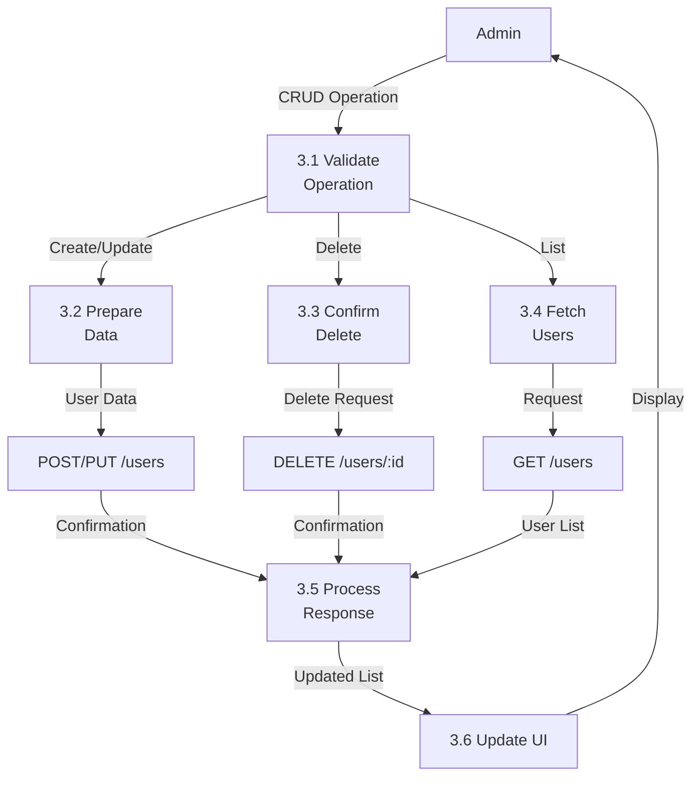

### DFD Level 2: Peserta Magang Management Process (4.0)

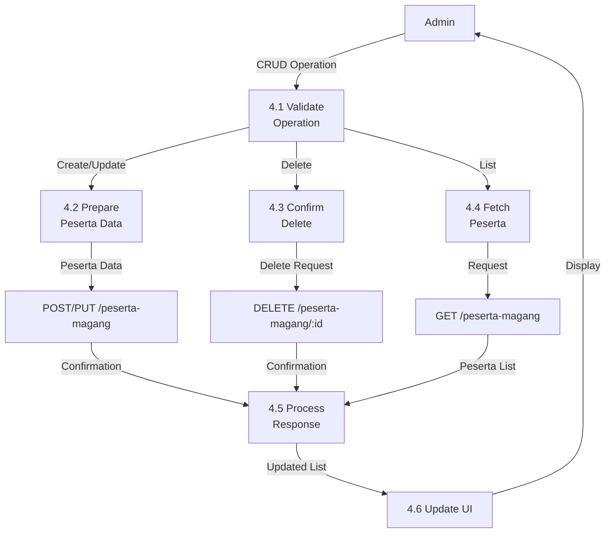

### DFD Level 2: Absensi Management Process (5.0)

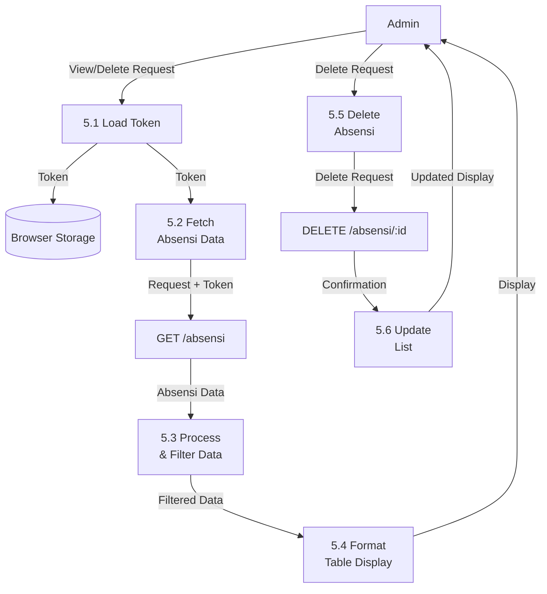

### DFD Level 2: Pengajuan Izin Management Process (6.0)

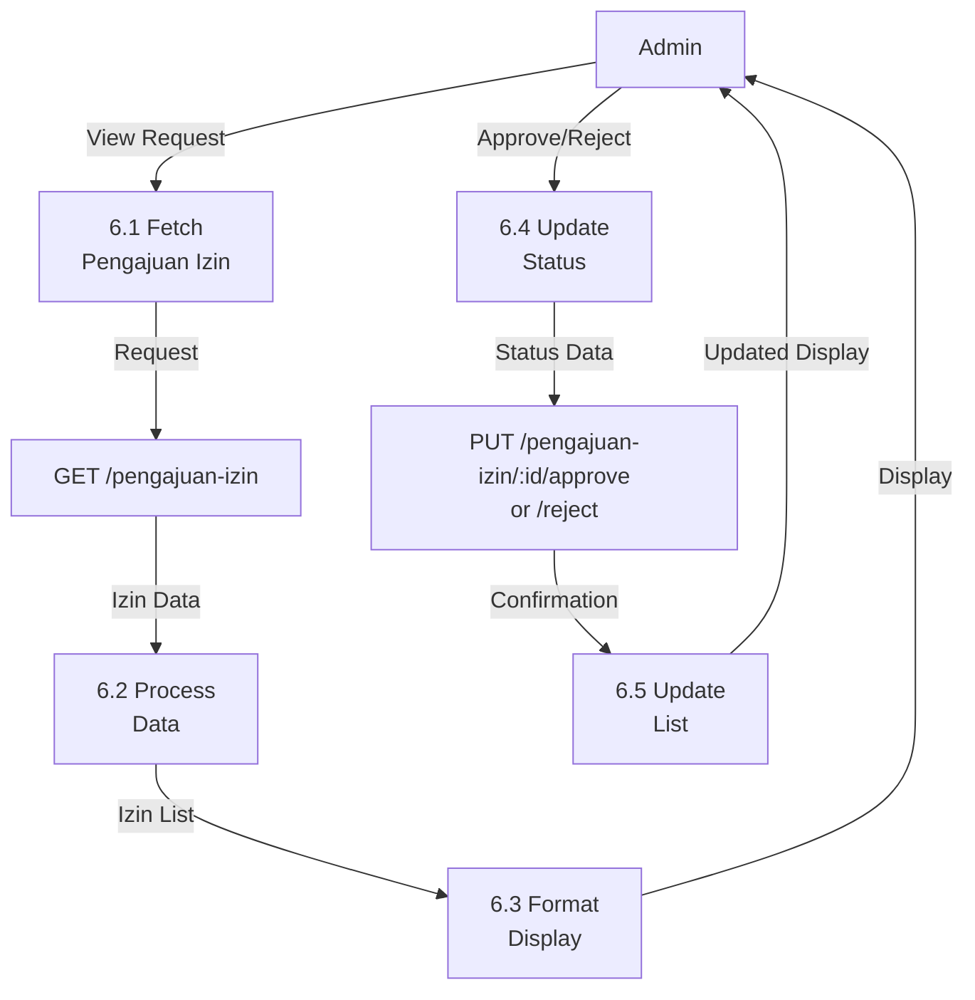

### DFD Level 2: Laporan Generation Process (7.0)

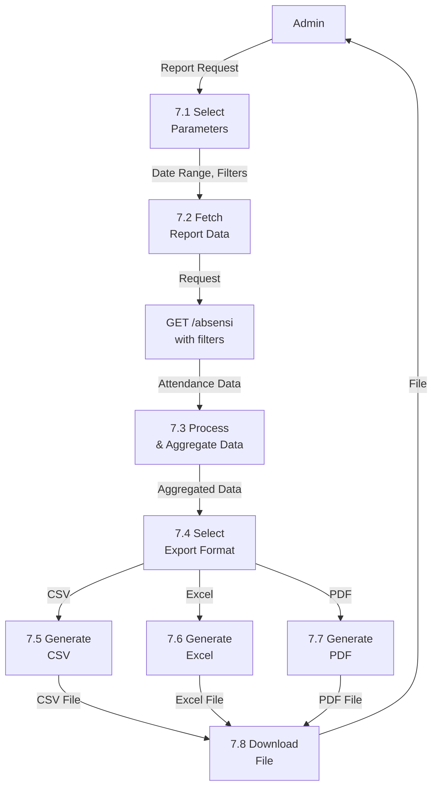

### DFD Level 2: Settings Management Process (8.0)

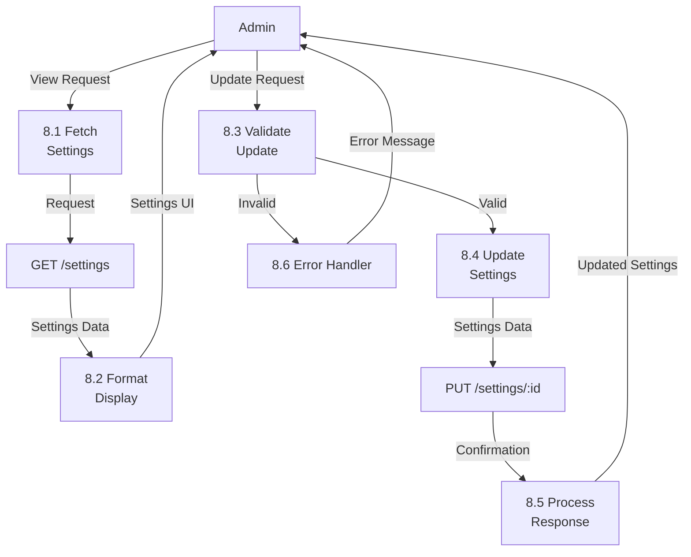

### DFD Level 2: QR Code Generation Process (9.0)

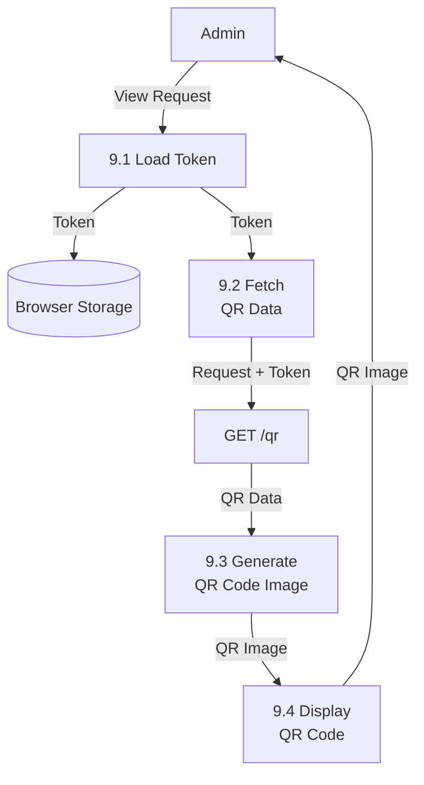

## 📊 Data Dictionary

### Data Stores

#### Browser Storage
- **Description**: Browser local storage atau session storage
- **Contents**: 
  - `auth_token`: JWT token
  - `user_data`: User profile data (JSON)
  - `theme_preference`: UI theme preference
- **Volume**: ~10-50 KB
- **Access**: Read/Write by all processes

### Data Flows

#### Authentication Data
- **From**: Admin → Authentication Process
- **To**: Backend API → Browser Storage
- **Contents**: Username, Password → JWT Token, User Data
- **Frequency**: Once per login session

#### Statistics Data
- **From**: Backend API → Dashboard Process
- **To**: Admin Display
- **Contents**: Aggregated statistics (counts, percentages, trends)
- **Frequency**: On dashboard load, refresh

#### Management Data (Users, Peserta, Absensi)
- **From**: Backend API → Management Processes
- **To**: Admin Display
- **Contents**: CRUD operation results, lists, confirmations
- **Frequency**: On operation request

#### Report Data
- **From**: Backend API → Report Generation Process
- **To**: Admin (File Download)
- **Contents**: Filtered attendance data, aggregated statistics
- **Frequency**: On report generation request

#### Settings Data
- **From**: Backend API → Settings Management Process
- **To**: Admin Display
- **Contents**: System configuration settings
- **Frequency**: On settings page load, after update

## 🔍 Process Descriptions

### 1.0 Authentication Process
- **Input**: Username, Password
- **Output**: JWT Token, User Data / Error Message
- **Process**: Validate credentials dengan backend, save token in browser storage
- **Data Stores**: Browser Storage (Write)

### 2.0 Dashboard Process
- **Input**: View Request
- **Output**: Dashboard Statistics
- **Process**: Fetch statistics from backend, aggregate and display
- **Data Stores**: Browser Storage (Read), Backend API (Read)

### 3.0 User Management Process
- **Input**: CRUD Operations
- **Output**: User List, Confirmation / Error Message
- **Process**: Create, Read, Update, Delete users via API
- **Data Stores**: Backend API (Read/Write)

### 4.0 Peserta Magang Management Process
- **Input**: CRUD Operations
- **Output**: Peserta List, Confirmation / Error Message
- **Process**: Create, Read, Update, Delete peserta magang via API
- **Data Stores**: Backend API (Read/Write)

### 5.0 Absensi Management Process
- **Input**: View/Delete Request
- **Output**: Absensi List / Confirmation
- **Process**: Fetch absensi data, display in table, handle delete operations
- **Data Stores**: Backend API (Read/Write)

### 6.0 Pengajuan Izin Management Process
- **Input**: View/Approve/Reject Request
- **Output**: Izin List, Status Update Confirmation
- **Process**: Fetch izin requests, approve/reject via API
- **Data Stores**: Backend API (Read/Write)

### 7.0 Laporan Generation Process
- **Input**: Report Parameters (Date Range, Filters)
- **Output**: Report File (CSV/Excel/PDF)
- **Process**: Fetch data, aggregate, generate file in selected format
- **Data Stores**: Backend API (Read)

### 8.0 Settings Management Process
- **Input**: Settings Update Request
- **Output**: Updated Settings / Error Message
- **Process**: Fetch settings, update via API
- **Data Stores**: Backend API (Read/Write)

### 9.0 QR Code Generation Process
- **Input**: View Request
- **Output**: QR Code Image
- **Process**: Fetch QR data from API, generate QR code image
- **Data Stores**: Backend API (Read)

## 🌐 Web-Specific Features

### State Management
- **React Hooks**: useState, useEffect untuk local state management
- **API Service**: Centralized API service layer
- **Error Handling**: Global error handling dengan user-friendly messages

### UI/UX Features
- **Responsive Design**: Mobile-friendly responsive layout
- **Real-time Updates**: Auto-refresh untuk data yang sering berubah
- **File Export**: Multiple format export (CSV, Excel, PDF)
- **Data Filtering**: Advanced filtering untuk absensi dan reports

### Security Features
- **JWT Authentication**: Token-based authentication
- **Protected Routes**: Route protection berdasarkan role
- **Input Validation**: Client-side validation sebelum API call
- **CORS Handling**: Proper CORS configuration

### Performance Optimization
- **Data Pagination**: Pagination untuk large datasets
- **Lazy Loading**: Lazy loading untuk components
- **Caching**: Browser storage caching untuk frequently accessed data

---

**Dibuat oleh**: Tim Development  
**Tanggal**: 2024  
**Versi**: 1.0.0  
**Platform**: React Web Application

