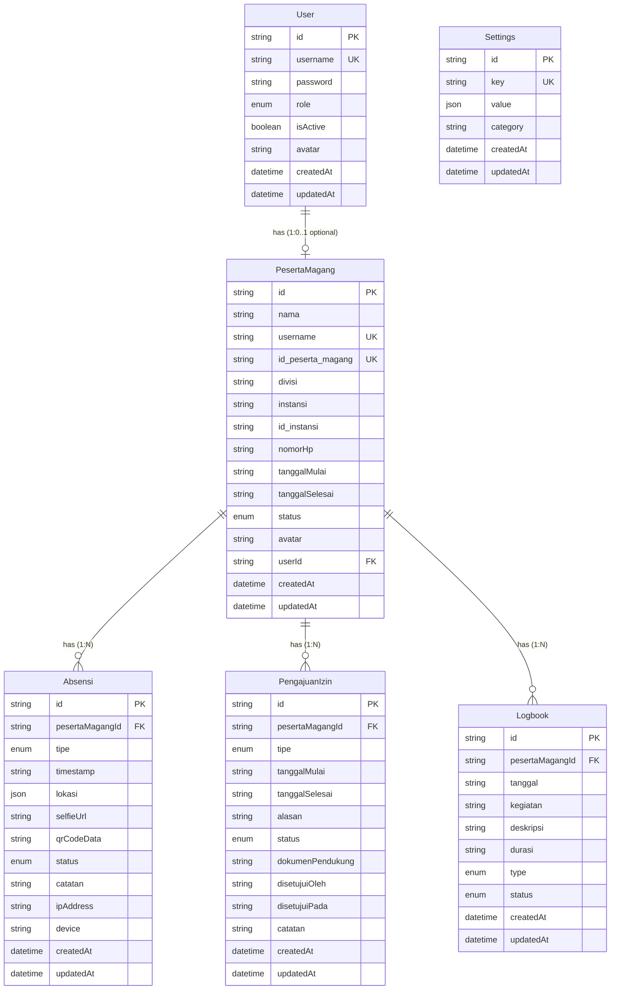

# Entity Relationship Diagram (ERD)
## Sistem Absensi Magang - Dokumentasi Lengkap

## 📊 Overview
Dokumen ini menjelaskan struktur database dan relasi antar entitas dalam sistem absensi magang yang digunakan baik oleh aplikasi mobile (Flutter) maupun web (React).

## 🗄️ Database Schema

### Entities (Tables)

#### 1. User
**Deskripsi**: Tabel untuk menyimpan data pengguna sistem (admin, pembimbing)
- `id` (String, PK): Unique identifier (CUID)
- `username` (String, Unique): Username untuk login
- `password` (String): Password terenkripsi (bcrypt)
- `role` (Enum: ADMIN, PESERTA_MAGANG, PEMBIMBING_MAGANG): Role pengguna
- `isActive` (Boolean, Default: true): Status aktif/nonaktif
- `avatar` (String, Optional): URL path avatar
- `createdAt` (DateTime): Timestamp pembuatan
- `updatedAt` (DateTime): Timestamp update terakhir

**Relasi**:
- One-to-One (Optional) dengan `PesertaMagang`

#### 2. PesertaMagang
**Deskripsi**: Tabel untuk menyimpan data peserta magang
- `id` (String, PK): Unique identifier (CUID)
- `nama` (String): Nama lengkap peserta
- `username` (String, Unique): Username unik untuk login
- `id_peserta_magang` (String, Optional, Unique): NISN/NIM peserta
- `divisi` (String): Divisi tempat magang
- `instansi` (String): Nama instansi/universitas
- `id_instansi` (String, Optional): ID instansi
- `nomorHp` (String): Nomor telepon
- `tanggalMulai` (String): Tanggal mulai magang (format: YYYY-MM-DD)
- `tanggalSelesai` (String): Tanggal selesai magang (format: YYYY-MM-DD)
- `status` (Enum: AKTIF, NONAKTIF, SELESAI): Status peserta
- `avatar` (String, Optional): URL path avatar
- `userId` (String, FK, Optional, Unique): Foreign key ke User
- `createdAt` (DateTime): Timestamp pembuatan
- `updatedAt` (DateTime): Timestamp update terakhir

**Relasi**:
- Many-to-One (Optional) dengan `User`
- One-to-Many dengan `Absensi`
- One-to-Many dengan `PengajuanIzin`
- One-to-Many dengan `Logbook`

#### 3. Absensi
**Deskripsi**: Tabel untuk menyimpan data absensi peserta magang
- `id` (String, PK): Unique identifier (CUID)
- `pesertaMagangId` (String, FK): Foreign key ke PesertaMagang
- `tipe` (Enum: MASUK, KELUAR, IZIN, SAKIT, CUTI): Tipe absensi
- `timestamp` (String): Waktu absensi (ISO 8601 format)
- `lokasi` (JSON, Optional): Data lokasi GPS
  ```json
  {
    "latitude": number,
    "longitude": number,
    "alamat": string
  }
  ```
- `selfieUrl` (String, Optional): URL path foto selfie
- `qrCodeData` (String, Optional): Data QR code yang di-scan
- `status` (Enum: VALID, INVALID, TERLAMBAT): Status absensi
- `catatan` (String, Optional): Catatan tambahan
- `ipAddress` (String, Optional): IP address saat absensi
- `device` (String, Optional): Informasi device (user agent)
- `createdAt` (DateTime): Timestamp pembuatan
- `updatedAt` (DateTime): Timestamp update terakhir

**Relasi**:
- Many-to-One dengan `PesertaMagang` (Cascade Delete)

#### 4. PengajuanIzin
**Deskripsi**: Tabel untuk menyimpan data pengajuan izin peserta magang
- `id` (String, PK): Unique identifier (CUID)
- `pesertaMagangId` (String, FK): Foreign key ke PesertaMagang
- `tipe` (Enum: SAKIT, IZIN, CUTI): Tipe izin
- `tanggalMulai` (String): Tanggal mulai izin (format: YYYY-MM-DD)
- `tanggalSelesai` (String): Tanggal selesai izin (format: YYYY-MM-DD)
- `alasan` (String): Alasan pengajuan
- `status` (Enum: PENDING, DISETUJUI, DITOLAK): Status pengajuan
- `dokumenPendukung` (String, Optional): URL path dokumen pendukung
- `disetujuiOleh` (String, Optional): User ID yang menyetujui
- `disetujuiPada` (String, Optional): Waktu persetujuan (ISO 8601)
- `catatan` (String, Optional): Catatan dari admin/pembimbing
- `createdAt` (DateTime): Timestamp pembuatan
- `updatedAt` (DateTime): Timestamp update terakhir

**Relasi**:
- Many-to-One dengan `PesertaMagang` (Cascade Delete)

#### 5. Logbook
**Deskripsi**: Tabel untuk menyimpan data logbook/kegiatan peserta magang
- `id` (String, PK): Unique identifier (CUID)
- `pesertaMagangId` (String, FK): Foreign key ke PesertaMagang
- `tanggal` (String): Tanggal kegiatan (format: YYYY-MM-DD)
- `kegiatan` (String): Nama/judul kegiatan
- `deskripsi` (String): Deskripsi detail kegiatan
- `durasi` (String, Optional): Durasi kegiatan (format: "X jam" atau "X menit")
- `type` (Enum: MEETING, TRAINING, PRESENTATION, DEADLINE, OTHER, Default: OTHER): Tipe kegiatan
- `status` (Enum: COMPLETED, IN_PROGRESS, PENDING, CANCELLED, Default: PENDING): Status kegiatan
- `createdAt` (DateTime): Timestamp pembuatan
- `updatedAt` (DateTime): Timestamp update terakhir

**Relasi**:
- Many-to-One dengan `PesertaMagang` (Cascade Delete)

#### 6. Settings
**Deskripsi**: Tabel untuk menyimpan konfigurasi sistem
- `id` (String, PK): Unique identifier (CUID)
- `key` (String, Unique): Key setting (unique)
- `value` (JSON): Nilai setting (berbagai tipe data)
- `category` (String): Kategori setting (work, location, security, dll)
- `createdAt` (DateTime): Timestamp pembuatan
- `updatedAt` (DateTime): Timestamp update terakhir

**Relasi**:
- Tidak ada relasi dengan tabel lain (standalone)

**Contoh Settings**:
- `workDays`: Array hari kerja (e.g., ["Monday", "Tuesday", ...])
- `workStartTime`: Jam mulai kerja (e.g., "08:00")
- `workEndTime`: Jam selesai kerja (e.g., "17:00")
- `officeLocation`: Koordinat lokasi kantor (latitude, longitude, radius)
- `allowLateCheckIn`: Boolean
- `lateThreshold`: Menit keterlambatan yang diizinkan
- `requireLocation`: Boolean
- `ipWhitelist`: Array IP yang diizinkan

## 🔗 Entity Relationships

### Relationship Diagram (Mermaid)



## 📝 Relationship Details

### 1. User ↔ PesertaMagang
- **Type**: One-to-One (Optional)
- **Cardinality**: 1:0..1
- **Description**: Satu User dapat memiliki maksimal satu PesertaMagang, atau tidak memiliki sama sekali
- **Foreign Key**: `PesertaMagang.userId` → `User.id`
- **Cascade**: ON DELETE CASCADE (jika User dihapus, PesertaMagang terkait juga dihapus)

### 2. PesertaMagang ↔ Absensi
- **Type**: One-to-Many
- **Cardinality**: 1:N
- **Description**: Satu PesertaMagang dapat memiliki banyak Absensi (satu per hari untuk MASUK/KELUAR)
- **Foreign Key**: `Absensi.pesertaMagangId` → `PesertaMagang.id`
- **Cascade**: ON DELETE CASCADE (jika PesertaMagang dihapus, semua Absensi terkait dihapus)

### 3. PesertaMagang ↔ PengajuanIzin
- **Type**: One-to-Many
- **Cardinality**: 1:N
- **Description**: Satu PesertaMagang dapat memiliki banyak PengajuanIzin
- **Foreign Key**: `PengajuanIzin.pesertaMagangId` → `PesertaMagang.id`
- **Cascade**: ON DELETE CASCADE (jika PesertaMagang dihapus, semua PengajuanIzin terkait dihapus)

### 4. PesertaMagang ↔ Logbook
- **Type**: One-to-Many
- **Cardinality**: 1:N
- **Description**: Satu PesertaMagang dapat memiliki banyak Logbook entries
- **Foreign Key**: `Logbook.pesertaMagangId` → `PesertaMagang.id`
- **Cascade**: ON DELETE CASCADE (jika PesertaMagang dihapus, semua Logbook terkait dihapus)

## 🎯 Enums

### Role
- `ADMIN`: Administrator sistem (akses penuh)
- `PESERTA_MAGANG`: Peserta magang (akses terbatas)
- `PEMBIMBING_MAGANG`: Pembimbing magang (akses review dan approval)

### StatusPeserta
- `AKTIF`: Peserta aktif magang
- `NONAKTIF`: Peserta nonaktif (ditangguhkan)
- `SELESAI`: Peserta sudah selesai magang

### TipeAbsensi
- `MASUK`: Absensi masuk/clock-in
- `KELUAR`: Absensi keluar/clock-out
- `IZIN`: Absensi dengan izin
- `SAKIT`: Absensi karena sakit
- `CUTI`: Absensi karena cuti

### StatusAbsensi
- `VALID`: Absensi valid dan sah
- `INVALID`: Absensi tidak valid (di luar radius, waktu, dll)
- `TERLAMBAT`: Absensi terlambat tetapi masih diizinkan

### TipeIzin
- `SAKIT`: Izin karena sakit
- `IZIN`: Izin biasa
- `CUTI`: Cuti

### StatusPengajuan
- `PENDING`: Menunggu persetujuan
- `DISETUJUI`: Disetujui oleh admin/pembimbing
- `DITOLAK`: Ditolak oleh admin/pembimbing

### ActivityType (Logbook)
- `MEETING`: Kegiatan meeting
- `TRAINING`: Kegiatan training
- `PRESENTATION`: Kegiatan presentasi
- `DEADLINE`: Kegiatan deadline/proyek
- `OTHER`: Kegiatan lainnya

### ActivityStatus (Logbook)
- `COMPLETED`: Kegiatan selesai
- `IN_PROGRESS`: Kegiatan sedang berlangsung
- `PENDING`: Kegiatan tertunda
- `CANCELLED`: Kegiatan dibatalkan

## 🔍 Indexes

### Unique Indexes
- `User.username` (Unique)
- `PesertaMagang.username` (Unique)
- `PesertaMagang.id_peserta_magang` (Unique, Optional)
- `PesertaMagang.userId` (Unique, Optional)
- `Settings.key` (Unique)

### Foreign Key Indexes
- `PesertaMagang.userId` → `User.id`
- `Absensi.pesertaMagangId` → `PesertaMagang.id`
- `PengajuanIzin.pesertaMagangId` → `PesertaMagang.id`
- `Logbook.pesertaMagangId` → `PesertaMagang.id`

## 🔐 Constraints

1. **Cascade Delete**: 
   - User deletion → PesertaMagang deletion (jika ada relasi)
   - PesertaMagang deletion → Absensi, PengajuanIzin & Logbook deletion

2. **Unique Constraints**:
   - Username must be unique per table (User & PesertaMagang)
   - Settings key must be unique
   - id_peserta_magang must be unique (if provided)

3. **Required Fields**:
   - Most fields are required except optional ones marked with `?`
   - Timestamps (createdAt, updatedAt) are auto-managed

## 📊 Database Statistics

- **Total Tables**: 6
- **Total Relationships**: 4
- **Total Enums**: 9
- **Database**: PostgreSQL
- **ORM**: Prisma
- **Primary Keys**: CUID (Collision-resistant Unique Identifier)

## 🌐 Platform Usage

### Mobile Application (Flutter)
- **Primary Entities**: PesertaMagang, Absensi, Logbook, PengajuanIzin
- **Read Operations**: Settings, User profile
- **Write Operations**: Absensi (MASUK/KELUAR), Logbook, PengajuanIzin

### Web Application (React)
- **Primary Entities**: All entities (full CRUD access)
- **Read Operations**: All entities
- **Write Operations**: All entities (depends on role)

### Backend API (Node.js/Express)
- **ORM**: Prisma Client
- **Validation**: Business logic in controllers
- **Authentication**: JWT-based
- **Authorization**: Role-based access control (RBAC)

---

**Dibuat oleh**: Tim Development  
**Tanggal**: 2024  
**Versi**: 2.0.0  
**Platform**: Mobile (Flutter) + Web (React) + Backend (Node.js/Express)

