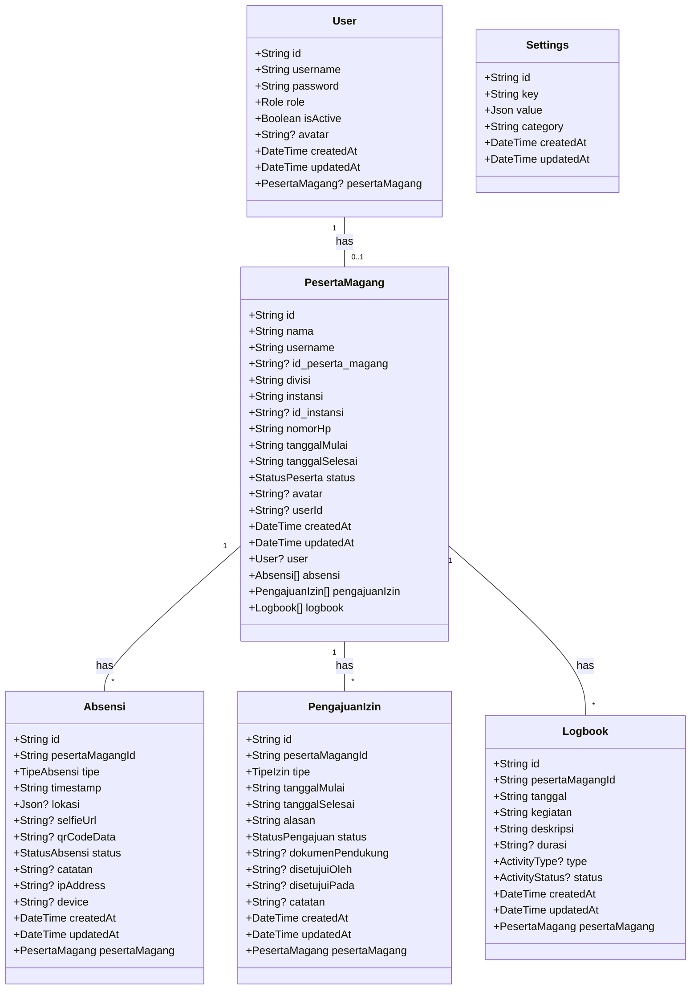
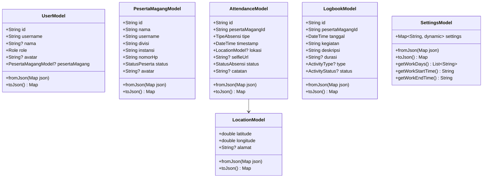
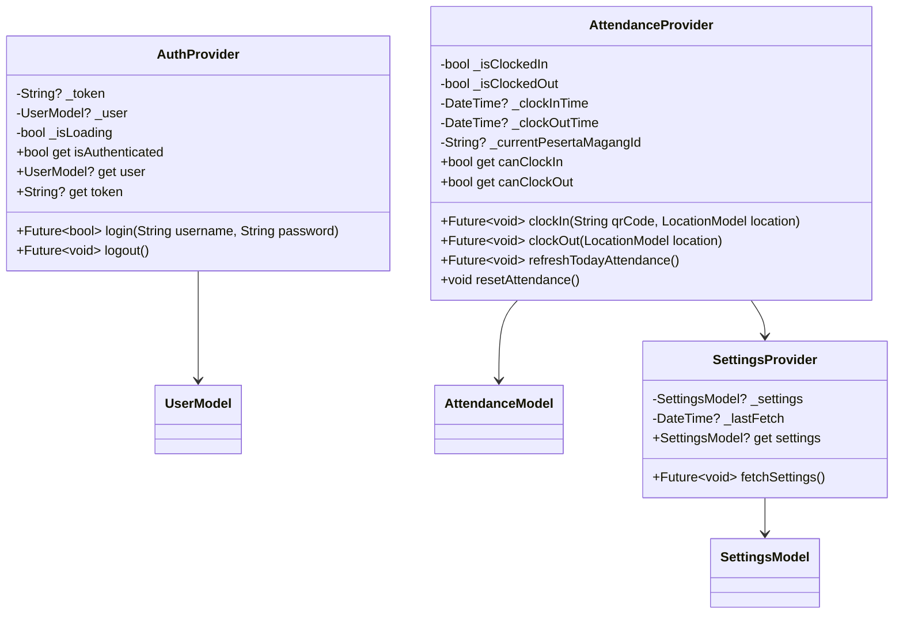
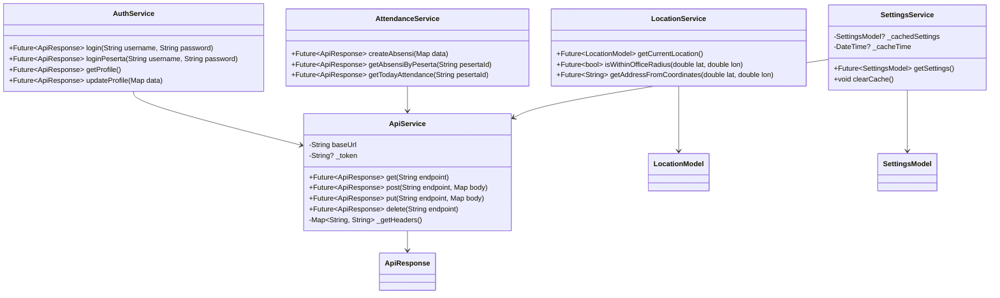
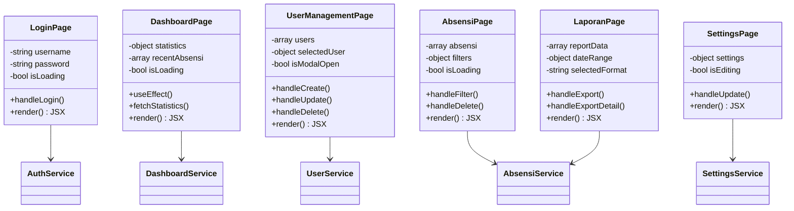
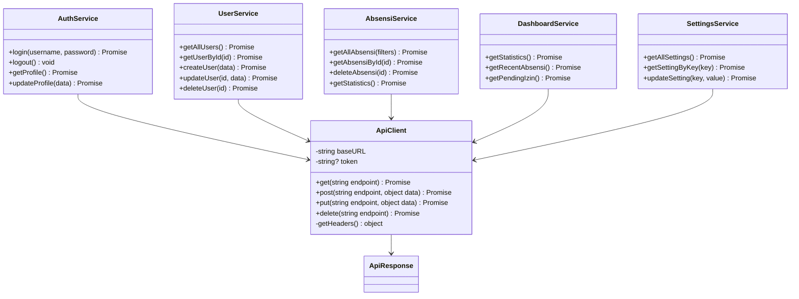
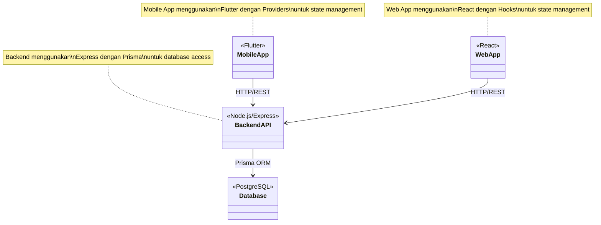

# UML Class Diagram - Complete
## Sistem Absensi Magang - Mobile & Web

## 📊 Overview
Dokumen ini menjelaskan struktur class dan model lengkap dalam sistem absensi magang, termasuk backend models, mobile models (Flutter), dan web components (React).

## 🏗️ Backend Class Structure

### Database Models (Prisma)

### Backend Controllers

```mermaid
classDiagram
    class AuthController {
        +login(req, res)
        +loginPeserta(req, res)
        +register(req, res)
        +getProfile(req, res)
        +updateProfile(req, res)
        +uploadAvatar(req, res)
        +deleteAvatar(req, res)
    }
    
    class AbsensiController {
        +createAbsensi(req, res)
        +getAllAbsensi(req, res)
        +getAbsensiById(req, res)
        +updateAbsensi(req, res)
        +deleteAbsensi(req, res)
        +getAbsensiByPeserta(req, res)
        -evaluateAttendanceRules(settings, timestamp, tipe)
    }
    
    class PesertaMagangController {
        +getAllPeserta(req, res)
        +getPesertaById(req, res)
        +createPeserta(req, res)
        +updatePeserta(req, res)
        +deletePeserta(req, res)
    }
    
    class UserController {
        +getAllUsers(req, res)
        +getUserById(req, res)
        +updateUser(req, res)
        +deleteUser(req, res)
        +activateUser(req, res)
        +deactivateUser(req, res)
    }
    
    class SettingsController {
        +getAllSettings(req, res)
        +getSettingByKey(req, res)
        +createSetting(req, res)
        +updateSetting(req, res)
        +deleteSetting(req, res)
    }
    
    class DashboardController {
        +getStatistics(req, res)
        +getRecentAbsensi(req, res)
        +getPendingIzin(req, res)
    }
    
    class PengajuanIzinController {
        +getAllIzin(req, res)
        +getIzinById(req, res)
        +createIzin(req, res)
        +updateIzin(req, res)
        +approveIzin(req, res)
        +rejectIzin(req, res)
        +deleteIzin(req, res)
    }
    
    class LogbookController {
        +getAllLogbook(req, res)
        +getLogbookById(req, res)
        +createLogbook(req, res)
        +updateLogbook(req, res)
        +deleteLogbook(req, res)
    }
    
    AuthController --> User
    AbsensiController --> Absensi
    AbsensiController --> Settings
    PesertaMagangController --> PesertaMagang
    UserController --> User
    SettingsController --> Settings
    DashboardController --> Absensi
    DashboardController --> PesertaMagang
    PengajuanIzinController --> PengajuanIzin
    LogbookController --> Logbook
```

## 📱 Mobile Application Classes (Flutter)

### Models

### Providers (State Management)

### Services

## 🌐 Web Application Classes (React/TypeScript)

### Components

### Services

## 🔗 Relationships Between Layers

## 📋 Enumerations

### Role (Backend & Mobile)
- `ADMIN`: Administrator sistem
- `PESERTA_MAGANG`: Peserta magang
- `PEMBIMBING_MAGANG`: Pembimbing magang

### StatusPeserta
- `AKTIF`: Peserta aktif
- `NONAKTIF`: Peserta nonaktif
- `SELESAI`: Peserta selesai magang

### TipeAbsensi
- `MASUK`: Clock-in
- `KELUAR`: Clock-out
- `IZIN`: Izin
- `SAKIT`: Sakit
- `CUTI`: Cuti

### StatusAbsensi
- `VALID`: Valid
- `INVALID`: Tidak valid
- `TERLAMBAT`: Terlambat

### TipeIzin
- `SAKIT`: Sakit
- `IZIN`: Izin
- `CUTI`: Cuti

### StatusPengajuan
- `PENDING`: Pending
- `DISETUJUI`: Disetujui
- `DITOLAK`: Ditolak

### ActivityType (Logbook)
- `MEETING`: Meeting
- `TRAINING`: Training
- `PRESENTATION`: Presentation
- `DEADLINE`: Deadline
- `OTHER`: Other

### ActivityStatus (Logbook)
- `COMPLETED`: Completed
- `IN_PROGRESS`: In Progress
- `PENDING`: Pending
- `CANCELLED`: Cancelled

---

**Dibuat oleh**: Tim Development  
**Tanggal**: 2024  
**Versi**: 2.0.0  
**Platform**: Mobile (Flutter) + Web (React) + Backend (Node.js/Express)

