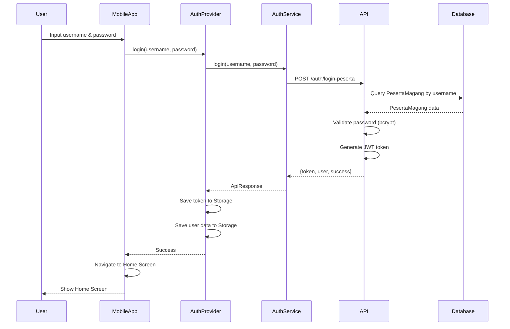
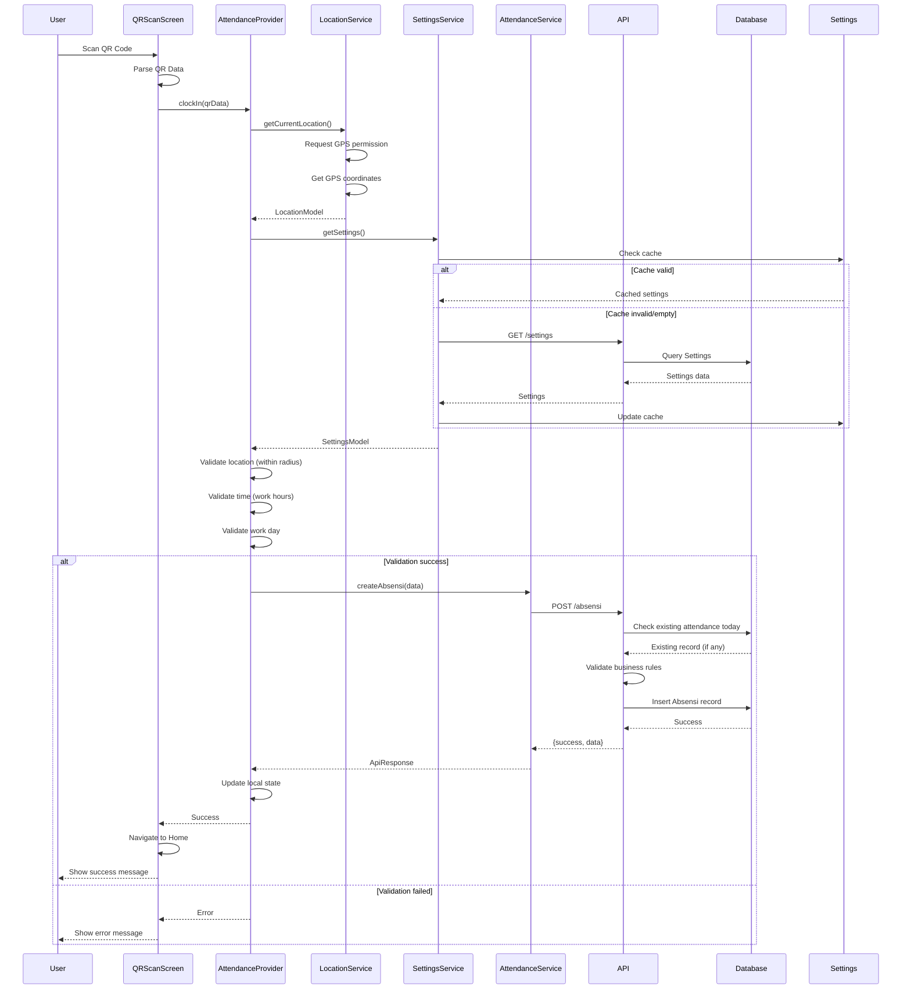
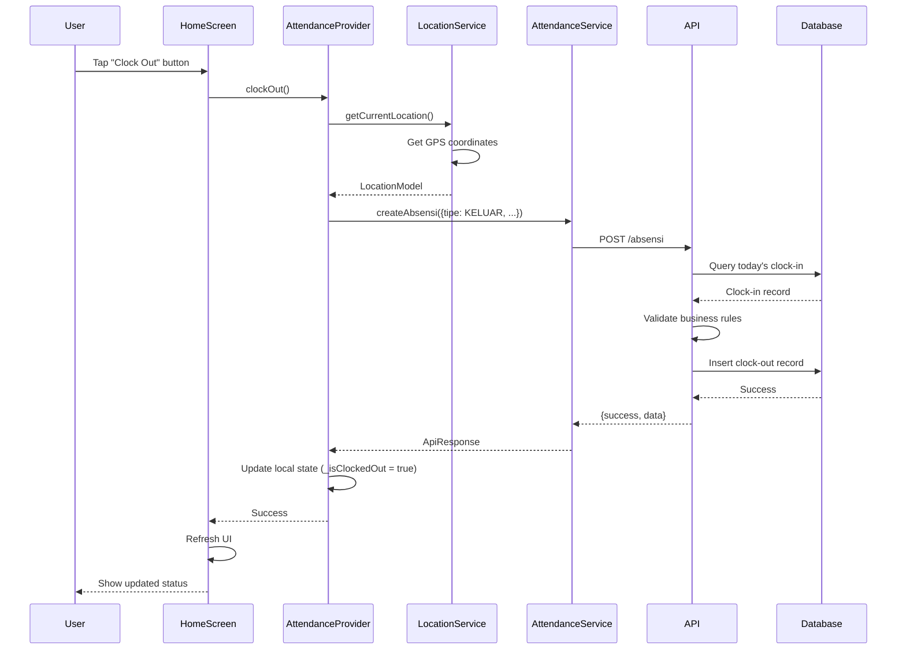
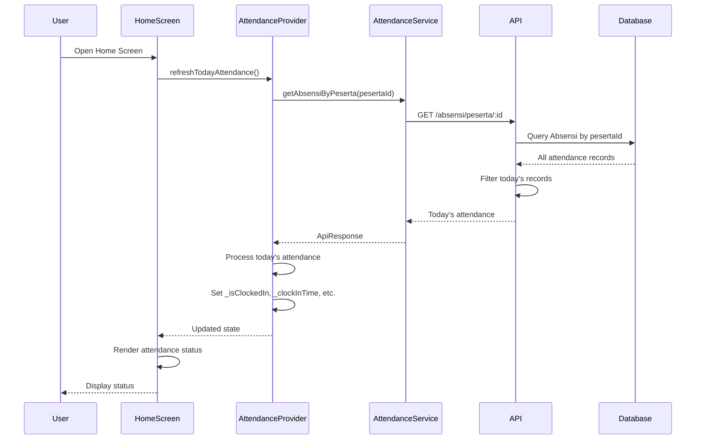
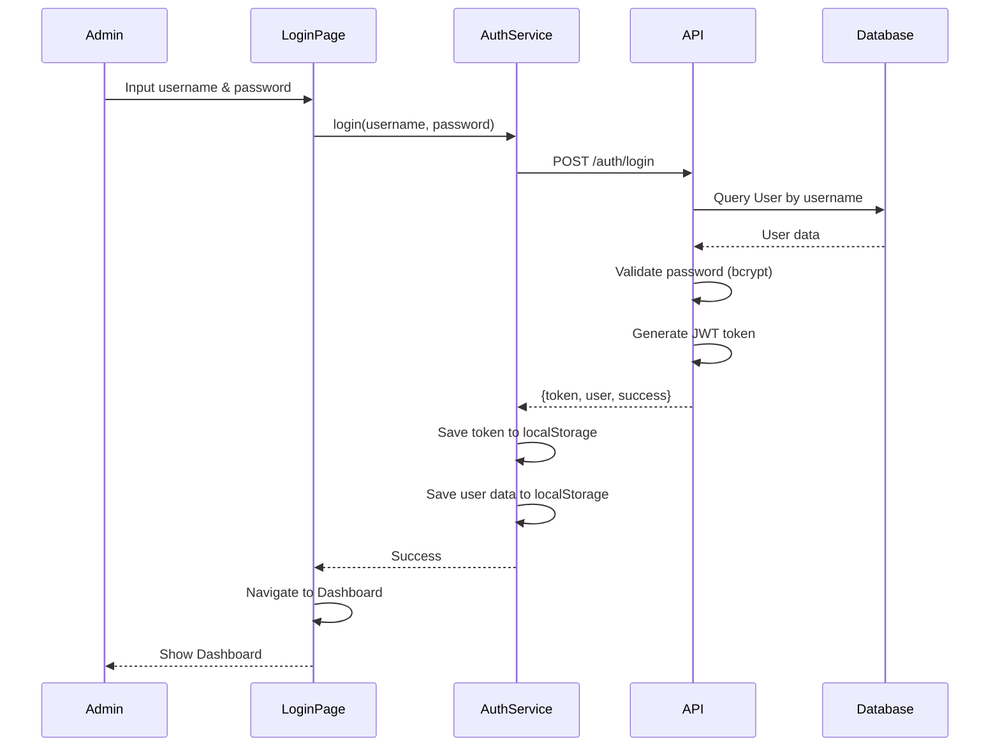
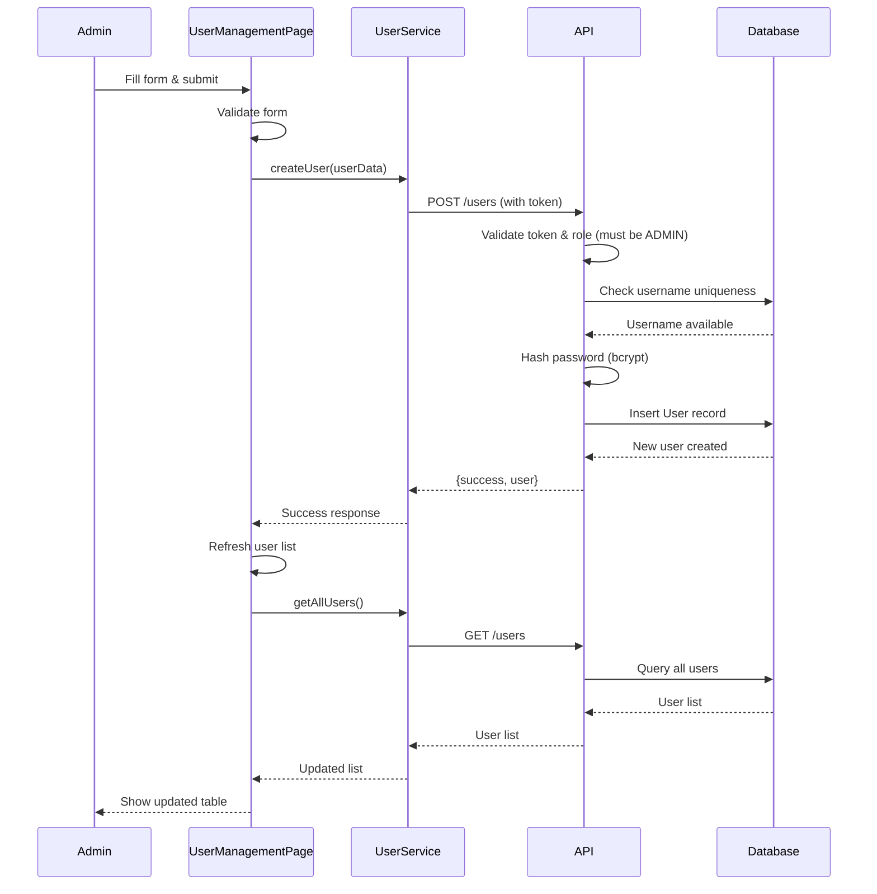
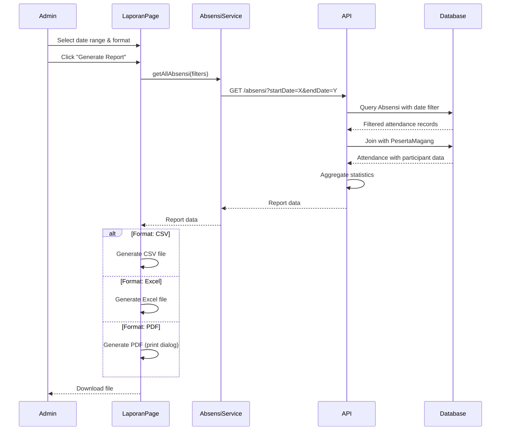
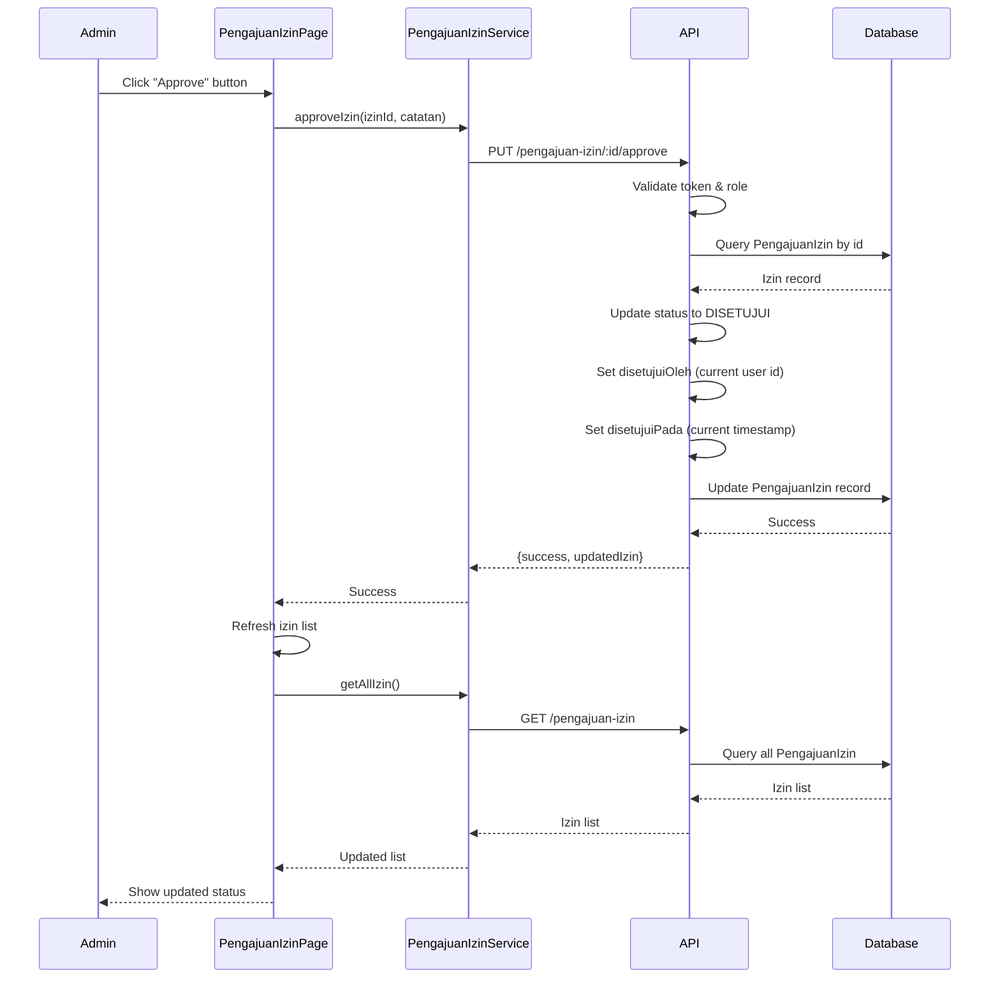
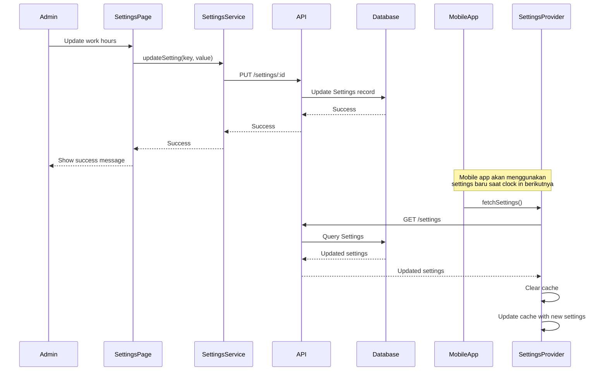

# UML Sequence Diagrams
## Sistem Absensi Magang - Mobile & Web

## 📊 Overview
Dokumen ini menjelaskan sequence diagrams untuk proses-proses penting dalam sistem absensi magang, baik untuk aplikasi mobile maupun web.

## 📱 Mobile Application Sequences

### 1. Login Process (Mobile)

### 2. Clock In Process (Mobile)

### 3. Clock Out Process (Mobile)

### 4. View Today's Attendance (Mobile)

## 🌐 Web Application Sequences

### 5. Admin Login Process (Web)

### 6. Create User (Web)

### 7. Generate Report (Web)

### 8. Approve Pengajuan Izin (Web)

## 🔄 Cross-Platform Sequences

### 9. Update Settings (Web) → Effect on Mobile

---

**Dibuat oleh**: Tim Development  
**Tanggal**: 2024  
**Versi**: 1.0.0  
**Platform**: Mobile (Flutter) + Web (React) + Backend (Node.js/Express)

