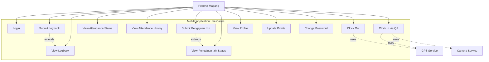

# UML Use Case Diagrams
## Sistem Absensi Magang - Mobile & Web

## 📊 Overview
Dokumen ini menjelaskan use case diagrams untuk aplikasi mobile dan web secara terpisah, menunjukkan aktor dan use case yang tersedia.

## 📱 Mobile Application Use Cases

### Use Case Diagram - Mobile App

### Mobile Use Case Details

#### UC1: Login
- **Aktor**: Peserta Magang
- **Precondition**: Aplikasi mobile terinstall
- **Main Flow**:
  1. User membuka aplikasi
  2. User memasukkan username dan password
  3. System memvalidasi credentials
  4. System menyimpan token
  5. System menampilkan Home Screen
- **Postcondition**: User berhasil login dan dapat mengakses fitur

#### UC2: Clock In via QR
- **Aktor**: Peserta Magang
- **Precondition**: User sudah login, QR code tersedia
- **Main Flow**:
  1. User membuka QR Scanner
  2. User scan QR code
  3. System mendapatkan lokasi GPS
  4. System memvalidasi lokasi (dalam radius)
  5. System memvalidasi waktu (work hours)
  6. System memvalidasi hari (work day)
  7. System membuat record absensi MASUK
  8. System menampilkan konfirmasi
- **Alternative Flow**:
  - Jika lokasi di luar radius: Tampilkan error
  - Jika di luar jam kerja: Tampilkan error
  - Jika sudah clock in hari ini: Tampilkan error
- **Postcondition**: Record absensi MASUK tersimpan

#### UC3: Clock Out
- **Aktor**: Peserta Magang
- **Precondition**: User sudah login, sudah clock in hari ini
- **Main Flow**:
  1. User membuka Home Screen
  2. User tap tombol "Clock Out"
  3. System mendapatkan lokasi GPS
  4. System membuat record absensi KELUAR
  5. System menampilkan konfirmasi
- **Postcondition**: Record absensi KELUAR tersimpan

#### UC4: View Attendance Status
- **Aktor**: Peserta Magang
- **Precondition**: User sudah login
- **Main Flow**:
  1. User membuka Home Screen
  2. System mengambil data absensi hari ini
  3. System menampilkan status (clock in/out time, status)
- **Postcondition**: Status absensi hari ini ditampilkan

#### UC5: View Attendance History
- **Aktor**: Peserta Magang
- **Precondition**: User sudah login
- **Main Flow**:
  1. User membuka Report Screen
  2. System mengambil semua data absensi user
  3. System menampilkan history dalam bentuk list
- **Postcondition**: History absensi ditampilkan

#### UC6: Submit Logbook
- **Aktor**: Peserta Magang
- **Precondition**: User sudah login
- **Main Flow**:
  1. User membuka Activities Screen
  2. User mengisi form logbook (tanggal, kegiatan, deskripsi, durasi)
  3. User submit logbook
  4. System menyimpan logbook
  5. System menampilkan konfirmasi
- **Postcondition**: Logbook tersimpan

#### UC7: View Logbook
- **Aktor**: Peserta Magang
- **Precondition**: User sudah login
- **Main Flow**:
  1. User membuka Activities Screen
  2. System mengambil semua logbook user
  3. System menampilkan list logbook
- **Postcondition**: List logbook ditampilkan

#### UC8: Submit Pengajuan Izin
- **Aktor**: Peserta Magang
- **Precondition**: User sudah login
- **Main Flow**:
  1. User membuka form pengajuan izin
  2. User mengisi form (tipe, tanggal, alasan, dokumen)
  3. User submit pengajuan
  4. System menyimpan pengajuan dengan status PENDING
  5. System menampilkan konfirmasi
- **Postcondition**: Pengajuan izin tersimpan dengan status PENDING

#### UC9: View Pengajuan Izin Status
- **Aktor**: Peserta Magang
- **Precondition**: User sudah login
- **Main Flow**:
  1. User membuka screen pengajuan izin
  2. System mengambil semua pengajuan user
  3. System menampilkan status (PENDING/DISETUJUI/DITOLAK)
- **Postcondition**: Status pengajuan izin ditampilkan

#### UC10: View Profile
- **Aktor**: Peserta Magang
- **Precondition**: User sudah login
- **Main Flow**:
  1. User membuka Profile Screen
  2. System mengambil data profile user
  3. System menampilkan profile (nama, divisi, instansi, dll)
- **Postcondition**: Profile user ditampilkan

#### UC11: Update Profile
- **Aktor**: Peserta Magang
- **Precondition**: User sudah login
- **Main Flow**:
  1. User membuka Edit Profile Screen
  2. User mengubah data (nama, nomor HP, avatar)
  3. User menyimpan perubahan
  4. System update profile di backend
  5. System menampilkan konfirmasi
- **Postcondition**: Profile terupdate

#### UC12: Change Password
- **Aktor**: Peserta Magang
- **Precondition**: User sudah login
- **Main Flow**:
  1. User membuka Change Password Screen
  2. User memasukkan password lama dan baru
  3. System memvalidasi password lama
  4. System update password
  5. System menampilkan konfirmasi
- **Postcondition**: Password terupdate

## 🌐 Web Application Use Cases

### Use Case Diagram - Web App (Admin)

```mermaid
graph TB
    subgraph "Web Application Use Cases - Admin"
        UC13[Admin Login]
        UC14[View Dashboard]
        UC15[Manage Users]
        UC16[Manage Peserta Magang]
        UC17[View Absensi]
        UC18[Delete Absensi]
        UC19[Manage Pengajuan Izin]
        UC20[Approve/Reject Izin]
        UC21[View Logbook]
        UC22[Manage Settings]
        UC23[Generate Reports]
        UC24[View QR Code]
        UC25[Export Reports]
    end
    
    Admin[Admin] --> UC13
    Admin --> UC14
    Admin --> UC15
    Admin --> UC16
    Admin --> UC17
    Admin --> UC18
    Admin --> UC19
    Admin --> UC20
    Admin --> UC21
    Admin --> UC22
    Admin --> UC23
    Admin --> UC24
    Admin --> UC25
    
    UC15 -.->|includes| UC15a[Create User]
    UC15 -.->|includes| UC15b[Update User]
    UC15 -.->|includes| UC15c[Delete User]
    UC15 -.->|includes| UC15d[Activate/Deactivate User]
    
    UC16 -.->|includes| UC16a[Create Peserta]
    UC16 -.->|includes| UC16b[Update Peserta]
    UC16 -.->|includes| UC16c[Delete Peserta]
    
    UC23 -.->|includes| UC25
    UC25 -.->|extends| UC25a[Export CSV]
    UC25 -.->|extends| UC25b[Export Excel]
    UC25 -.->|extends| UC25c[Export PDF]
```

### Web Use Case Details

#### UC13: Admin Login
- **Aktor**: Admin
- **Precondition**: Web application dapat diakses
- **Main Flow**:
  1. Admin membuka login page
  2. Admin memasukkan username dan password
  3. System memvalidasi credentials
  4. System menyimpan token
  5. System menampilkan Dashboard
- **Postcondition**: Admin berhasil login

#### UC14: View Dashboard
- **Aktor**: Admin
- **Precondition**: Admin sudah login
- **Main Flow**:
  1. Admin membuka Dashboard
  2. System mengambil statistics (total peserta, absensi hari ini, dll)
  3. System menampilkan dashboard dengan charts dan statistics
- **Postcondition**: Dashboard ditampilkan

#### UC15: Manage Users
- **Aktor**: Admin
- **Precondition**: Admin sudah login
- **Includes**: Create User, Update User, Delete User, Activate/Deactivate User
- **Main Flow**: Admin dapat melakukan CRUD operations pada users
- **Postcondition**: Users terkelola

#### UC16: Manage Peserta Magang
- **Aktor**: Admin
- **Precondition**: Admin sudah login
- **Includes**: Create Peserta, Update Peserta, Delete Peserta
- **Main Flow**: Admin dapat melakukan CRUD operations pada peserta magang
- **Postcondition**: Peserta magang terkelola

#### UC17: View Absensi
- **Aktor**: Admin
- **Precondition**: Admin sudah login
- **Main Flow**:
  1. Admin membuka Absensi Page
  2. System mengambil semua data absensi
  3. System menampilkan dalam bentuk table dengan filter
- **Postcondition**: List absensi ditampilkan

#### UC18: Delete Absensi
- **Aktor**: Admin
- **Precondition**: Admin sudah login, absensi tersedia
- **Main Flow**:
  1. Admin memilih absensi untuk dihapus
  2. Admin konfirmasi delete
  3. System menghapus record absensi
  4. System menampilkan konfirmasi
- **Postcondition**: Absensi terhapus

#### UC19: Manage Pengajuan Izin
- **Aktor**: Admin
- **Precondition**: Admin sudah login
- **Main Flow**:
  1. Admin membuka Pengajuan Izin Page
  2. System mengambil semua pengajuan izin
  3. System menampilkan dalam bentuk table
  4. Admin dapat melihat detail pengajuan
- **Postcondition**: List pengajuan izin ditampilkan

#### UC20: Approve/Reject Izin
- **Aktor**: Admin
- **Precondition**: Admin sudah login, pengajuan izin tersedia
- **Main Flow**:
  1. Admin memilih pengajuan izin
  2. Admin klik Approve atau Reject
  3. Admin dapat menambahkan catatan (optional)
  4. System update status pengajuan
  5. System menampilkan konfirmasi
- **Postcondition**: Status pengajuan izin terupdate

#### UC21: View Logbook
- **Aktor**: Admin
- **Precondition**: Admin sudah login
- **Main Flow**:
  1. Admin membuka Logbook Page
  2. System mengambil semua logbook
  3. System menampilkan dalam bentuk table
- **Postcondition**: List logbook ditampilkan

#### UC22: Manage Settings
- **Aktor**: Admin
- **Precondition**: Admin sudah login
- **Main Flow**:
  1. Admin membuka Settings Page
  2. System mengambil semua settings
  3. Admin dapat mengubah settings (work hours, location, dll)
  4. Admin menyimpan perubahan
  5. System update settings
- **Postcondition**: Settings terupdate

#### UC23: Generate Reports
- **Aktor**: Admin
- **Precondition**: Admin sudah login
- **Main Flow**:
  1. Admin membuka Laporan Page
  2. Admin memilih filter (date range, peserta, dll)
  3. System mengambil data sesuai filter
  4. System menampilkan report data
- **Postcondition**: Report data ditampilkan

#### UC24: View QR Code
- **Aktor**: Admin
- **Precondition**: Admin sudah login
- **Main Flow**:
  1. Admin membuka QR Code Page
  2. System mengambil QR code data dari backend
  3. System generate QR code image
  4. System menampilkan QR code
- **Postcondition**: QR code ditampilkan

#### UC25: Export Reports
- **Aktor**: Admin
- **Precondition**: Admin sudah login, report data tersedia
- **Extends**: Export CSV, Export Excel, Export PDF
- **Main Flow**:
  1. Admin memilih format export (CSV/Excel/PDF)
  2. Admin klik export
  3. System generate file sesuai format
  4. System download file ke browser
- **Postcondition**: File report terdownload

---

**Dibuat oleh**: Tim Development  
**Tanggal**: 2024  
**Versi**: 1.0.0  
**Platform**: Mobile (Flutter) + Web (React)

